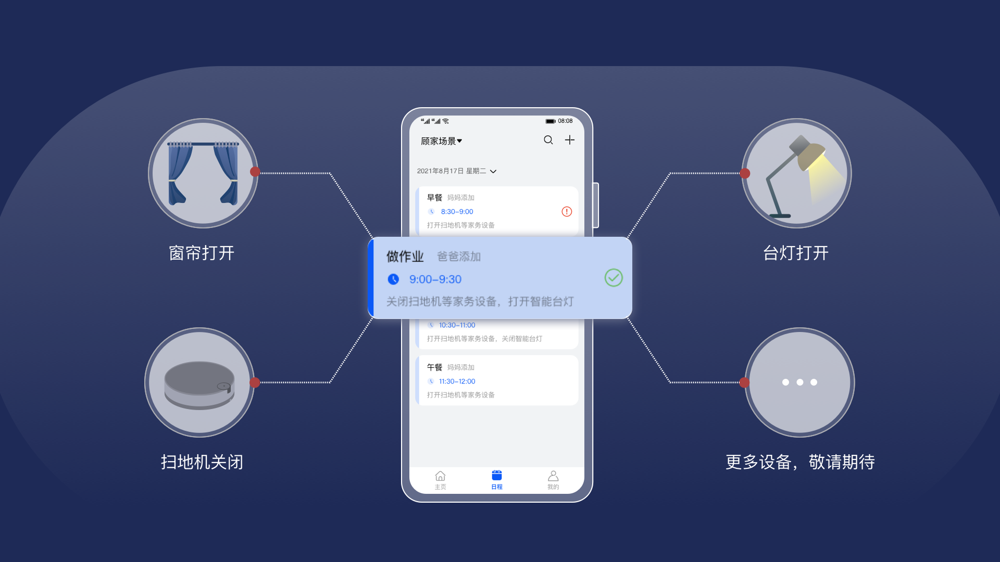

## knowledge_demo_smart_home

#### 介绍
​        小孩放学了，做作业的时间到，窗帘、护眼灯自动打开，关掉电视和扫地机，给小孩一个安静舒适的学习环境；碰到学习难题，可以随时请求你的远程指导。晚上回家休息了，选择舒适的氛围灯，伴随着睡眠音乐进入梦乡。 出门远行，也不担心家里的“多肉”植物和宠物无人照顾，这样的生活体验是不是很棒？让你的生活每天轻松惬意！

​       然而现实很骨感，在我们实际生活中遇到的往往是：小孩放假在家中无人看管，出门在外，家里诸多事宜放心不下。你是不是在某一刻想到，怎样让家里的智能设备来主动的动起来，像《钢铁侠》里面的“贾维斯”一样不需要你操心。现在我们有了一个可以将家中的所有智能设备组织联合的数字管家，通过日程编排把涉及到的智能设备串联起来，共同组建不同的场景，打破硬件设备之间的壁垒，成为你工作生活的好帮手；开源的运作模式让所有志同道合的开发者参与进来，共同开发各种智能设备，完善各种场景，让设备品类越来越丰富。





待补充具体产品完整的体验GIF 图片。

#### 目录结构
本仓库目录结构由如下4部分内容构成：

FA :  HarmoyOS手机侧数字管家应用代码，主要包括相关智能设备配网、控制，操作日程，接收告警消息等功能，详细介绍见[数字管家应用文档](./FA/DistSchedule/README_zh.md) ；

Server：数字管家服务端代码，管理日程、用户、设备、家庭信息，并对接华为IOT云实现命令、告警转发等功能，详细介绍见[服务端文档](./Server/README.md) ；

dev   : 数字管家对应常见智能设备代码(智能窗帘、智能台灯等)，主要包括控制命令接收、消息上报等功能，详细介绍见[设备侧相关文档](./dev/docs/README.md) ；

profile :主要描述设备与数字管家应用间沟通的模型文件，详细介绍见[沟通模型文档](./profile/README.md)。

```
.
├── dev
│   ├── device // 存放相关设备开发sdk
│   ├── docs   // 存放dev 开发相关的智能设备开发文档
│   ├── team_x // 具体相关智能设备的应用代码
│   └── third_party // 设备开发相关的第三方库文件
├── FA
│   └── DistSchedule  // 数字管家应用代码
├── profile // 设备与应用间沟通的模型文件
└── Server
    ├── design // 服务端设计文档
    ├── distschedule-core // 入口模块，包含main和controller
    ├── distschedule-dao  // 数据库模块
    └── distschedule-service  // 服务模块
```


#### 快速上手体验

按照[数字管家快速上手指南](./dev/docs/quick_start/README.md)中的步骤，一步步执行，就可以快速体验数字管家。


#### 参与贡献

1. Fork 本仓库
2. 新建 Feat_xxx 分支
3. 提交代码
4. 新建 Pull Request


具体步骤细节请参考[代码贡献文档](./dev/docs/contribute/README.md)

请扫描下面的二维码，加入OpenHarmony 数字管家交流群，开始你的开源共建之路吧！

 


#### FAQs

​    待补充

#### 相关仓

[知识体系相关文档仓库](https://gitee.com/openharmony-sig/knowledge)

