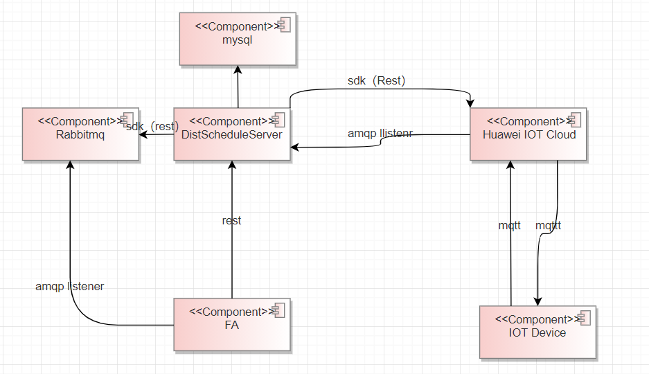
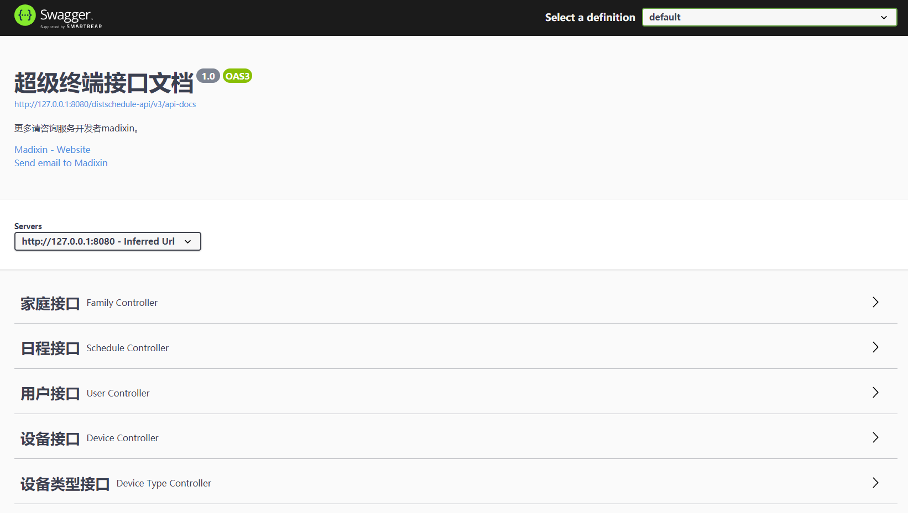
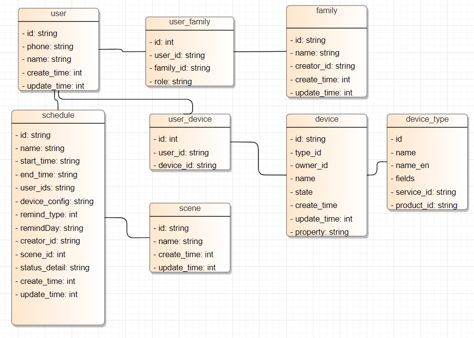
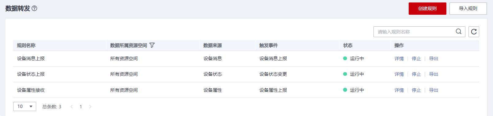

# DistScheduleServer
数字管家服务端

## 数字管家整体架构视图

模块说明：
- FA:  数字管家HarmonyOS应用
- IOT Device: 基于OpenHarmony开发板的智能设备，如台灯，窗帘
- DistScheduleServer: 数字管家服务端，对FA提供Restful接口，并调用Huawei IOT Cloud管理IOT设备
- Huawei IOT Cloud： 华为IOT云，用于以mqtt协议，与设备通信。如下发命令，上报状态
- RabbitMQ：消息队列，用于获取告警信息，通知给手机FA
- MySql：数据库。保存日程，设备，用户，家庭等信息
## 如何构建
下载代码
```bash
git clone git@gitee.com:openharmony-sig/knowledge_demo_smart_home.git
```

编译环境：
1. jdk8
2. maven 3.6.3

进入目录，编译springboot jar包
```bash
cd knowledge_demo_smart_home/Server
mvn clean package
```
可执行的jar包在knowledge_demo_smart_home/Server/distschedule-core/target/distschedule-core-1.0.0-SNAPSHOT.jar`

## 如何运行
1. 在mysql中创建数据库distschedule，并编写配置文件application-local.properties
```
# mysql数据库配置，需要提前部署和创建数据库
spring.datasource.url=datasource_url:jdbc:mysql://*****:3306/distschedule?useUnicode=true&characterEncoding=utf-8&useSSL=false&allowMultiQueries=true&serverTimezone=Asia/Shanghai
spring.datasource.username=*****
spring.datasource.password=****

# 华为IOT云配置，参考下面的介绍，申请IOT云的AK,SK,APPID
cloud.iot.ak=*****
cloud.iot.sk=*****
cloud.iot.appId=*****

# IOT云配置，参考下面的介绍，配置并获取华为IOT云的数据转发队列
cloud.iot.amqp.accessKey=*****
cloud.iot.amqp.password=*****
cloud.iot.amqp.queueStatusName=*****
cloud.iot.amqp.queuePropertyName=*****
cloud.iot.amqp.queueMsgName=*****
cloud.iot.amqp.connectionUrl=amqps://*****.iot-amqps.cn-north-4.myhuaweicloud.com:5671?amqp.vhost=default&amqp.idleTimeout=8000&amqp.saslMechanisms=PLAIN


# rabbitmq消息队列，用于手机监听告警信息
spring.rabbitmq.host=*****
spring.rabbitmq.port=*****
spring.rabbitmq.username=*****
spring.rabbitmq.password=*****
spring.rabbitmq.exchange.deviceproperty=madixin_deviceproperty_exchange
```


2.指定profile运行，目前支持的profile有local，可以新增其它profile

可通过环境变量指定所激活的profile
```bash
export SPRING_PROFILES_ACTIVE=local # 激活local
```
```
 nohup java -jar /opt/distschedule-core-1.0.0-SNAPSHOT.jar --spring.profiles.active=local> /clouddragonData/log/distschedule/server.log 2>&1 &
```

## 部署环境搭建
1.Ubuntu 18.04.4 or 20

2.mysql5.7 (sudo apt install mysql-server)

3.openjdk/jdk 1.8 (sudo apt-get install openjdk-8-jdk)

4.RabbitMQ 3.6.10

5.IOT云服务([华为云](https://console.huaweicloud.com/iotdm/?region=cn-north-4#/dm-portal/home))

## 配置服务自启动
参考文档：https://www.cnblogs.com/airdot/p/9688530.html
```
java -jar /opt/distschedule-core-1.0.0-SNAPSHOT.jar --spring.profiles.active=qianfu > /clouddragonData/log/distschedule/server.log 2>&1 &
```

## 工程结构
```
- distschedule--core       # 入口模块，包含main和controller
- distschedule-service     # 服务模块
- distschedule-dao         # 数据库模块
```

## 接口描述
集成Swagger3.0，部署以后使用swagger.html查看接口，即http://127.0.0.1:8080/distschedule-api/swagger-ui/index.html
包括如下接口：
- 家庭接口
- 日程接口
- 用户接口
- 设备接口
- 设备类型接口


## 数据库设计

使用flyway自动创建数据库，数据库表放在：
distschedule-dao\src\main\resources\db\migration 目录下

## 华为IOT云配置
1.使用华为云IOT服务：[地址](https://console.huaweicloud.com/iotdm/?region=cn-north-4#/dm-portal/instance)，建议先[极速体验](https://support.huaweicloud.com/qs-iothub/iot_05_00010.html)

2. 新增IOT设备，创建产品(Profile)，定义属性，命令，参考[profile](https://gitee.com/openharmony-sig/knowledge_demo_smart_home/tree/master/profile)

2.申请AK,SK，并配置到配置文件application-xxx.properties中.参考[获取AK/SK](https://support.huaweicloud.com/devg-apisign/api-sign-provide-aksk.html)

```
cloud.iot.ak=*****
cloud.iot.sk=*****
cloud.iot.appId=*****
```

3.配置规则，转发设备状态到AMQP(需要转发设备属性，命令，消息)
并配置队列名，队列地址，accessKey，password到配置文件application-xxx.properties中.参考[规则引擎介绍](https://support.huaweicloud.com/usermanual-iothub/iot_01_0022.html)

配置设备消息上报，转发到队列queueMsgName

配置设备状态上报，转发到队列queueStatusName

配置设备属性上报，转发到队列queuePropertyName

```
cloud.iot.amqp.accessKey=***
cloud.iot.amqp.password=*****
cloud.iot.amqp.queueStatusName=****
cloud.iot.amqp.queuePropertyName=****
cloud.iot.amqp.queueMsgName=****
cloud.iot.amqp.connectionUrl=****
```


获取设备的名称，服务ID，产品ID，插入数据库中。建议是在knowledge_demo_smart_home\Server\distschedule-dao\src\main\resources\db\migration目录中新增SQL，如V2_insertProductType.sql
```
INSERT INTO device_type (`name`, `name_en`, `service_id`, `product_id`, `category`)
values ('智能风扇', 'fan', 'SmartFan', '6150601d88056b027dd2ca47', 1);
```

## 容器镜像制作及docker-compose启动
1.华为IOT云创建产品，profile，设备转发规则，并申请AK,SK修改application-local.properties配置文件  (跟非容器启动一样)

2.配置application-dockercompose.yml关于IOT云的相关配置

3.修改V1__CreateTables.sql关于device_type设备类型的插入,尤其是配置service_id,product_id

4.构建容器镜像，使用docker-compose启动
```
mvn clean package
docker build -t distschedule .
docker-compose up
```