# 设备碰一碰配置指南

### 一、简介

碰一碰是HarmonyOS具备的多终端业务协同技术。其依托NFC短距通信协议，通过碰一碰的交互方式，将手机和全场景设备连接起来。然后通过手机端的原子化服务能力，快速完成配网、远程控制的能力，解决了应用与设备之间接续慢、配网复杂、传输难的问题，为用户带来无缝切换的流畅体验。

### 二、碰一碰配置

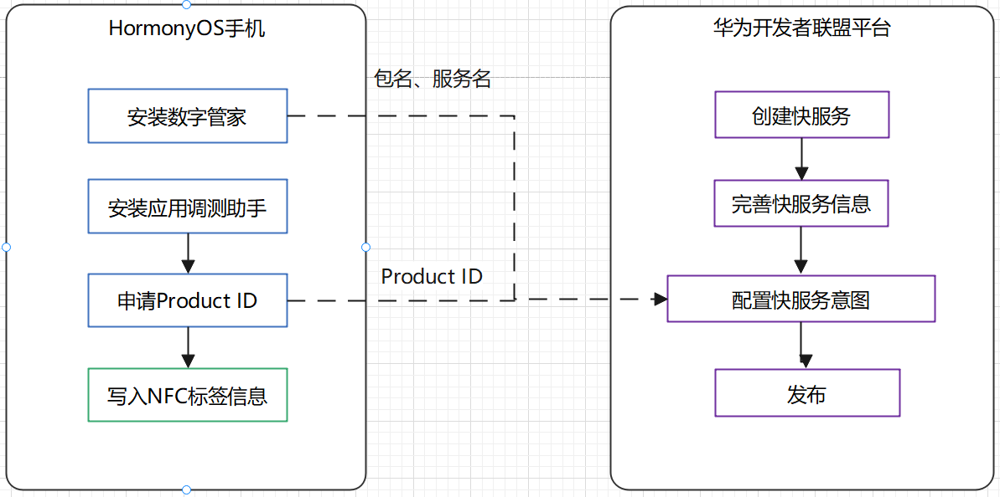

#### 前提

- 已安装数字管家应用。
- 准备已经升级至HarmonyOS 2系统的华为Mate系列或P系列手机，系统版本号为2.0.0.168及以上。
- 在华为应用市场，下载并安装“应用调测助手”APP，用于写NFC标签。
- 若开发板不包含NFC模块，则需准备1个NFC标签，可以用手机触碰NFC标签，提前确保NFC功能可用。
- 打开手机**设置 > 应用和服务 > 应用管理**，搜索“智慧生活基础服务”，检测智慧生活基础服务的版本是否为12.0.2.306及以上。如果不是，请打开华为手机的“智慧生活”APP，点击“**我的 > 设置 > 检查应用更新**”，更新“智慧生活基础服务”。

#### 智慧服务配置

##### 申请Product ID

注：本节中Product ID是碰一碰拉起标识，而非IoTDA平台的设备品类ID。

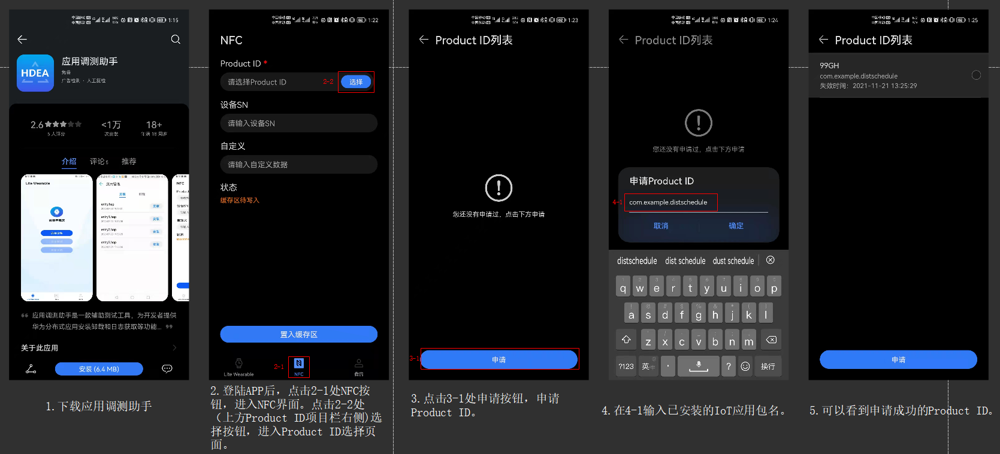

##### 登陆[华为开发者联盟](https://developer.huawei.com/consumer/cn/)

登陆华为开发者联盟，主页右上角管理中心按钮，进入管理中心。

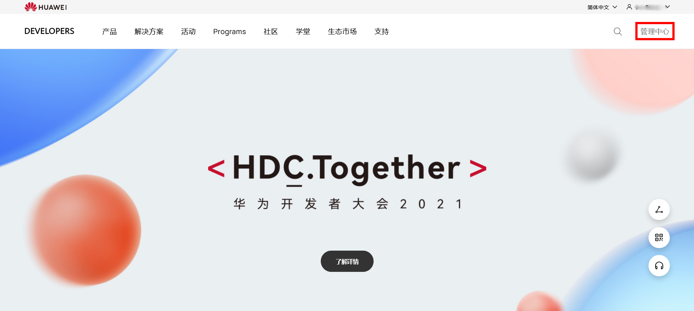

##### 创建快服务

在管理中心页面中依次点击智慧服务->华为快服务智慧平台进入快服务智慧平台。

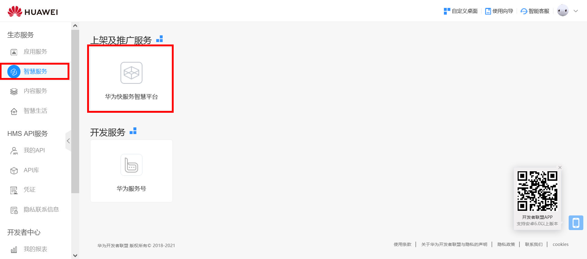

点击右上角创建快服务按钮。

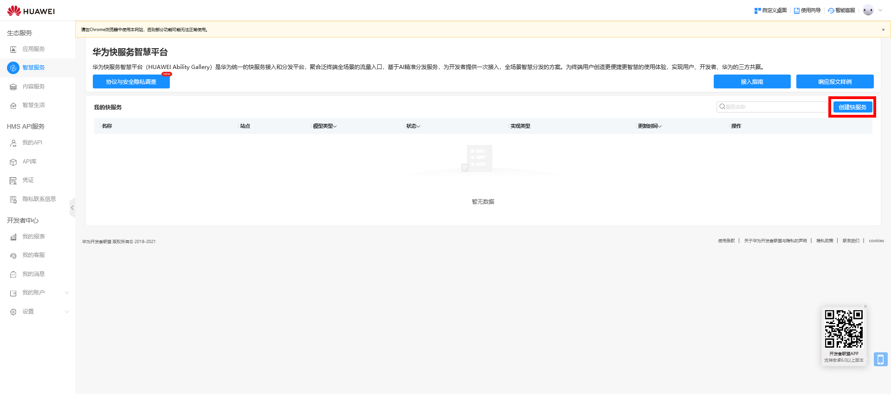

点击快服务模型，填写服务相关信息，点击创建按钮完成快服务模型的创建。

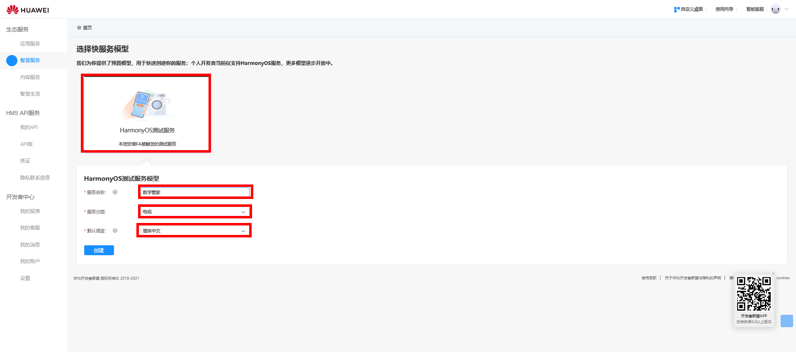

##### 录入快服务信息

在服务信息栏下的基本信息页面完善快服务模型基本信息后，点击右上角保存按钮，保存快服务基本信息。

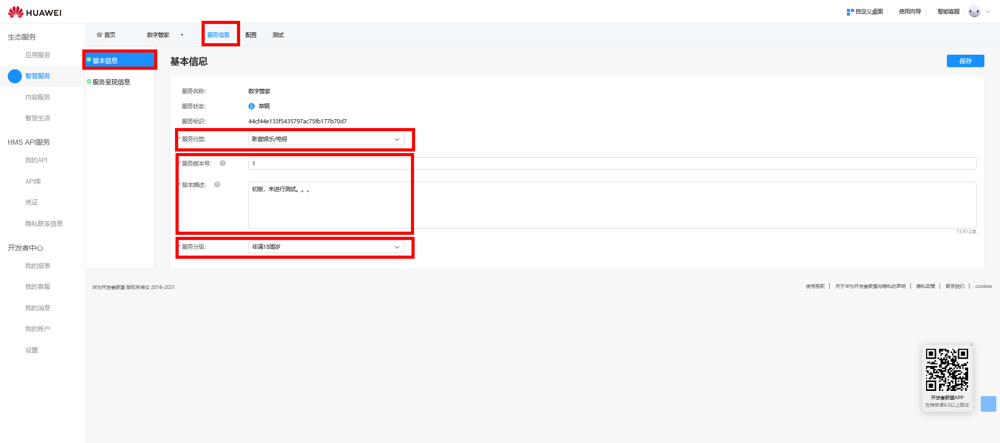

进入服务呈现信息页面完善相关信息（星标项目必填，其它项目视需要进行填写），可下载批量导入模板并填写，进行批量导入。点击右上角保存按钮，保存服务呈现信息。

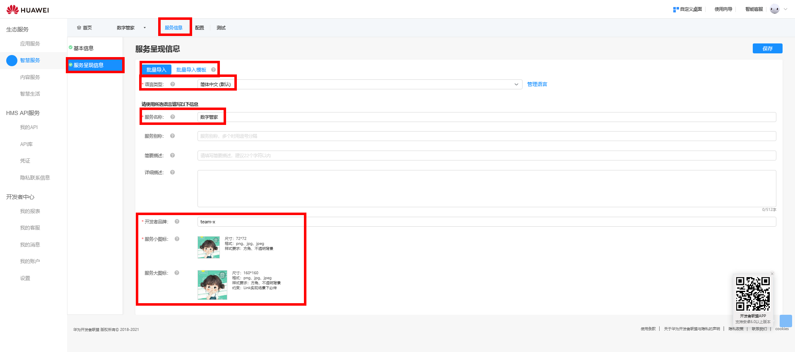

##### 录入快服务配置信息

点击配置栏，进行配置信息的填写。
HarmonyOS标签页面如下图，其中产品型号填写在应用调测助手中申请的Product ID ，产品子型号填写00。

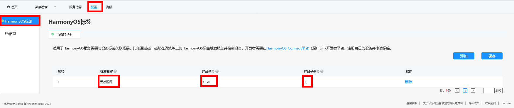

FA信息页面填写信息如下图，其中App包名、服务名分别为FA开发中对应的IoT应用的包名，以及开发者期望通过NFC唤起的IoT应用的服务名（本项目唤起的服务为设备配网）。

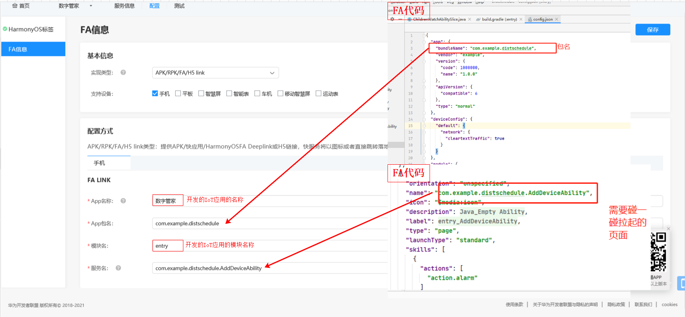

##### 录入快服务测试信息

点击测试栏，进入快服务测试页面，进行测试相关信息的填写。
点击创建进入创建真机测试名单窗口。

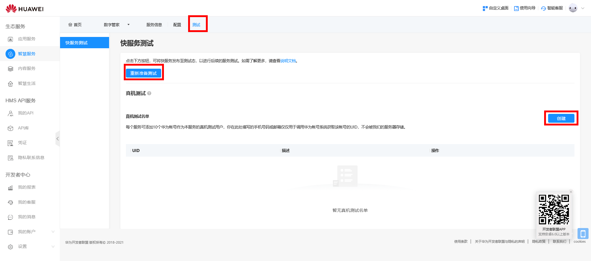

填写手机号码与描述。

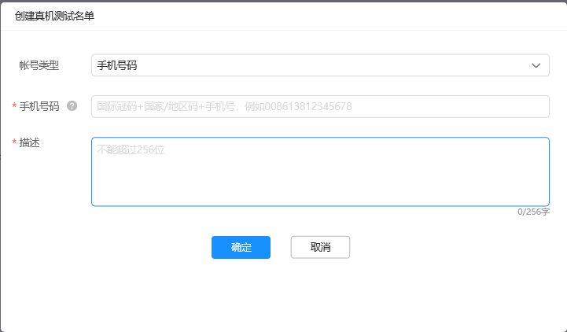

 点击确定可以看到该手机已经录入名单中。

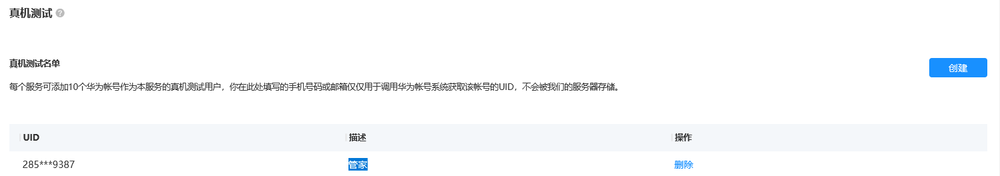

到此，应用功能唤起信息申请和配置完成。

#### 设备信息的准备

##### 信息内容

配网信息内容包括：华为IoTDA平台的Product ID、设备ID；配网方式以及对应的参数信息；整个信息存储在NFC当前的91字段。

##### 存储格式

设备信息采用TLV格式。

  T:标签，1字节

  L:T信息长度，2字节

  V:T对应的详细信息

##### 标签分配

| 标签代号 | 意义                | 限制条件                                                     | 样例                             |
| :------: | ------------------- | ------------------------------------------------------------ | -------------------------------- |
|    1     | IoTDA平台设备品类ID | 典型值24字节，小于32字节                                     | 6128c7b60ad1ed0286680f19         |
|    2     | 设备ID              | 典型值8字节，小于64字节                                      | Lamp01                           |
|    3     | DevicePwd           | 典型值8字节，小于32字节                                      | 12345678                         |
|    4     | 配网标识            | 1字节                                                        | 0，非配网设备；1，softap；2，ble |
|    5     | ApSSID              | 典型值12字节，小于32字节，WIFI配网下必须提供；构成一般为前缀teamX + 设备ID模式 | teamX-Lamp01                     |
|    6     | ApToken             | 典型值8字节，小于16字节；WIFI配网下必须提供（可以置空）      | 12345678                         |
|    7     | BLE-MAC             | 典型值6字节；BLE配网下必须提供                               | 010203040506                     |

+ 内容都展示的是ascii码，写入NFC标签的是对应的HEX数值；和碰一碰习惯保持一致；
+ DeviceID由FA读取NFC之后，使用华为IoTDA平台设备品类ID+‘’_“+"设备ID"拼接而成，如华为IoTDA平台设备品类ID为6128c7b60ad1ed0286680f19，设备ID为Lamp01,则生成的DeviceID为”6128c7b60ad1ed0286680f19_Lamp01“

##### 生成配网信息

则基于上述规则写入NFC标签中的配网信息为：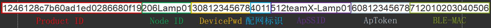

### 三、NFC数据写入

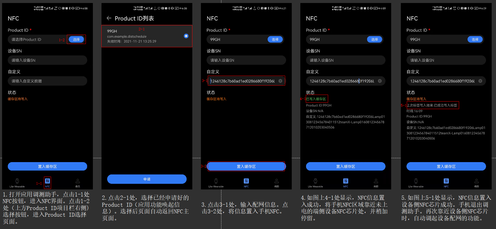
