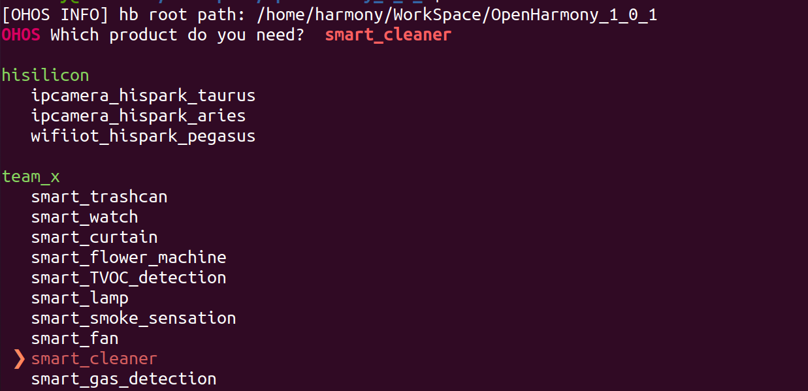

### 编译

```
#进入源码目录
#rm -rf  ohos_config.json
#hb set
#.
#如下图所示,按↑↓键，选择需要编译的工程名，然后回车
```



```
#hb build -f
#然后回车，等待屏幕出现：BUILD SUCCESS字样，说明编译成功。如下图
```


```
#编译生成的固件在如下路径,以下以smart_trashcan示例，不同demo在相应demo路径下
#cd ~/WorkSpace/OpenHarmony_1_0_1/out/hispark_pegasus/smart_trashcan
如下图示
```


### 烧录

[烧录工具下载Hiburn](https://harmonyos.51cto.com/resource/29)

```
#通过TypeC数据线，将电脑与设备连接。
#安装CH340驱动，下载地址：http://www.wch.cn/search?q=ch340g&t=downloads
#查看开发板的串口，如下图
```


```
#在Windows中打开Hiburn工具，并点击`Refresh`，选择相应com，本示例中为com5和上图相匹配，如下图示
```


```
配置波特率为921600,如下图示
```


```
点击Hiburn工具中的Select file按钮，在弹出的文件框中，选择代码编译所生成的固件然后确认；选中Auto burn按钮，然后点击connect按钮，等待下载，如下图
```


```
按下设备上的复位按钮，开始烧录固件，如下图所示
```


```
等待进度条跑完，则烧录完成。
```

