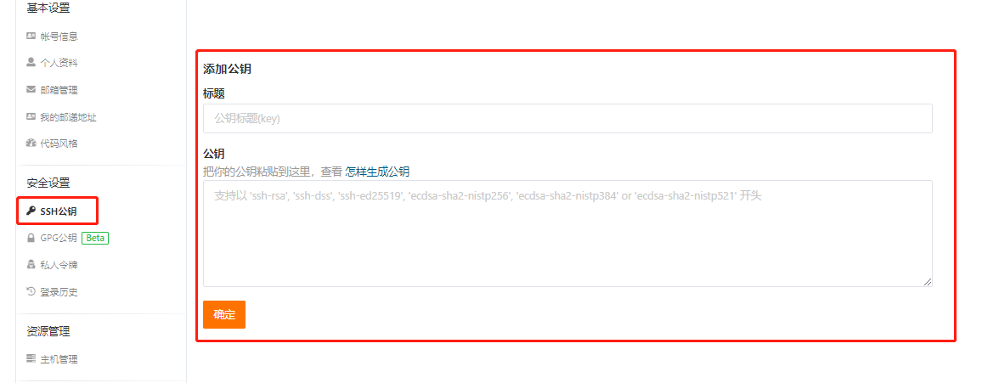
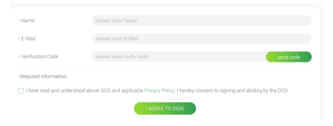
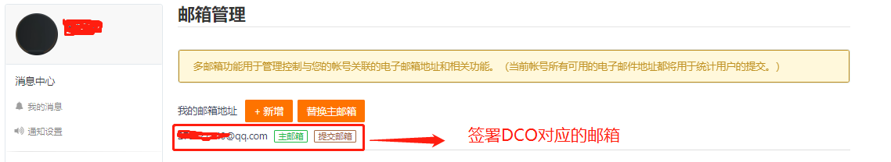
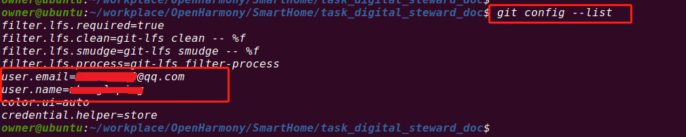
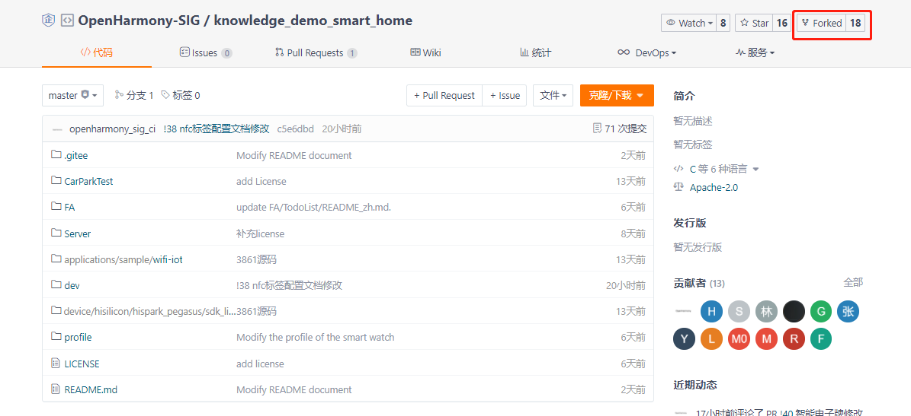
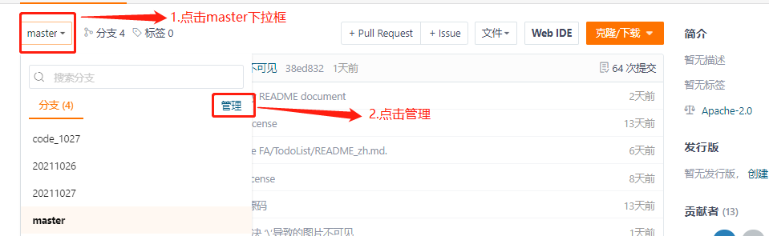
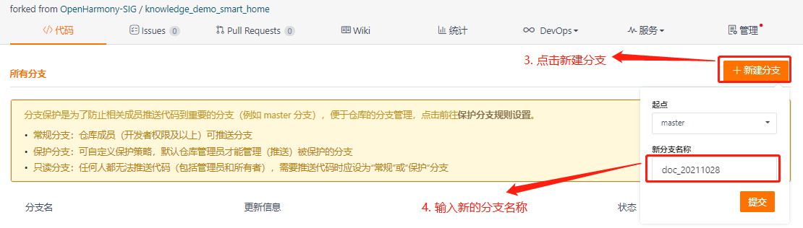
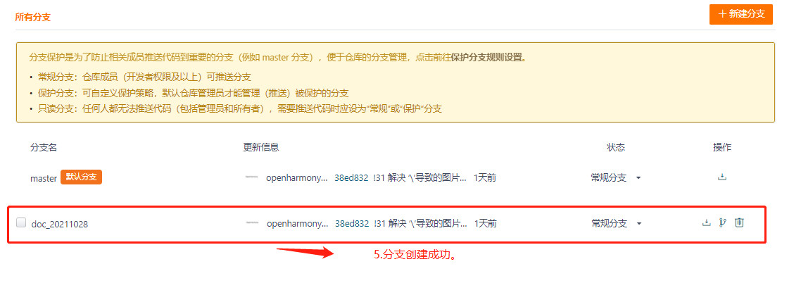
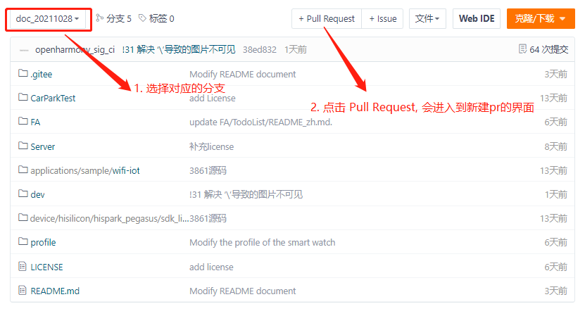
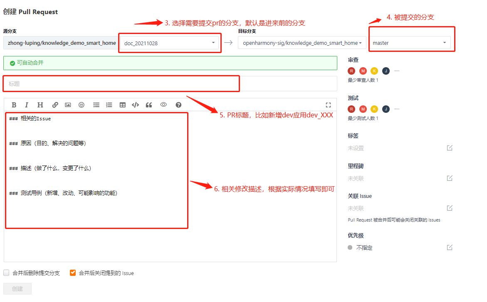

# 合作共建

## 参与贡献

### 注册账户

​	参与社区贡献的前提是必须有着社区对应的账号，如果已经有gitee账号的可以忽略此点。

 1. 注册gitee.com 账号，并确保账号已绑定相应邮箱

 2. 确保gitee账号中已添加 ssh 密钥。

    

### 签dco 协议

​	提交的pull request首先要经过dco检查，因此需要签署原子基金会的DCO协议。签署地址：[DCO协议签署](https://dco.openharmony.io/sign/Z2l0ZWUlMkZvcGVuX2hhcm1vbnk=)

​	签署DCO协议的界面如下图：

​	

需输入相关姓名和 邮箱账号和邮箱接收到的验证码。其中，邮箱需要是gitee账号绑定的邮箱。个人绑定邮箱可以在【个人设置 - 邮箱管理】 中查看：



为避免代码提交时发生错误，请保证 git 环境变量中的user.email 与gitee绑定的邮箱一致。可通过git config来查看git环境变量中的邮箱地址：



### Fork 本仓库

​	进入到本仓库([地址](../)),然后点击右上角Forked，这个时候会将本仓fork到自己账户的名下。



### 新建 Feat_xxx 分支

​	为了方便管理，上传代码或者文档一般都不用master分支来，我们需要新建一个分支来处理对应的操作。创建分支步骤如下：







### 下载代码

 创建完自己的分支后，我们就可以将代码下载下来，下载代码的命令：

```
git clone git@gitee.com:xxxxxxxxx/knowledge_demo_smart_home.git -b doc_20211028是之前创建的分支

## 其中xxxxxxxxx对应的是当前账户信息, -b doc_20211028对应的是之前创建的分支
```


### 提交代码

1. 代码修改完后，需要将代码提交到对应自己的私仓，命令如下：

```
git add ./							## 添加当前目录下所有文件
git commit -s -m "修改内容"			  ## 添加修改内容
git push origin doc_20211028		## 提交代码到分支 doc_20211028
```

2. commit 相关参数介绍：

   -s ：Signed-off-by 签名信息，如果没有这个选项的话，提PR的时候会提示错误：“该PR提交是否包含 Signed-off-by信息”。

   -m: log 信息，即我们修改了什么内容。

   ​		log信息格式定义如下：

   ​		新添 -- add

   ​		删除 -- delete

   ​		修改 -- modify

   如此次提交修改了fiel1文件，对应commit的信息：git commit -s -m "modify file1"

### 新建 Pull Request

​		代码提交后，需要将提交的代码同步到主仓库中，这个时候需要通过提Pull Request到主仓库，代码合规没有任何问题后会自动合并到主仓库中。

​		



到此，PR的新建已经完成。当PR验证成功后，代码会自动合并到提PR的目标分支上。如果PR不通过，可以点击新建的PR，里面会有具体原因描述。

## 社区贡献规则

### 编程规范

​	请参考官方文档:[贡献代码](https://gitee.com/openharmony/docs/blob/OpenHarmony_1.0.1_release/zh-cn/contribute/%E8%B4%A1%E7%8C%AE%E4%BB%A3%E7%A0%81.md)

### sig仓命名规范

​	遵循unix K&R编码风格

### 代码路径规范

​	遵循unix K&R编码风格

### pr（Pull Request）规范

提交PR的时候需要遵循以下几点描述：

1. 相关issue的描述
2. 原因(目的，解决的问题等)
3. 描述(做了什么，变更了什么)
4. 测试用例(新增，改动，可能影响的功能)
