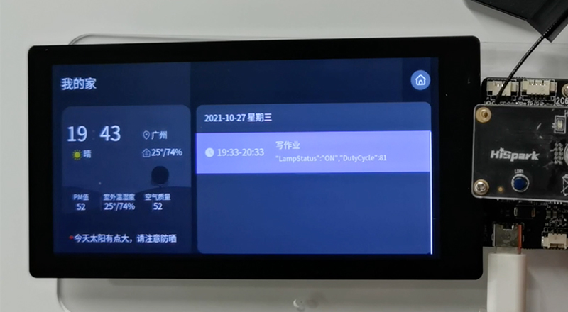
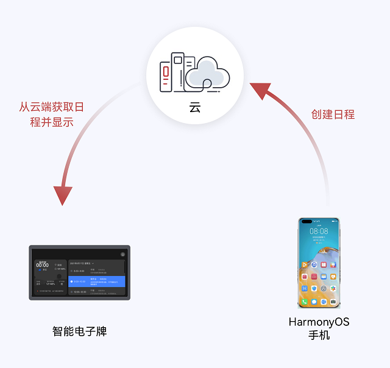
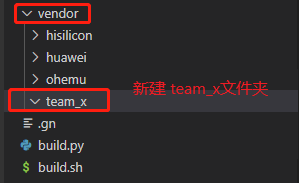
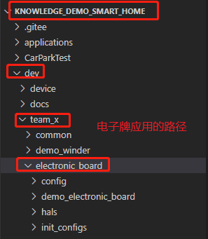
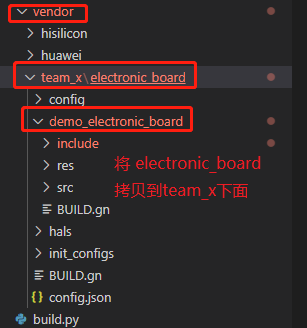
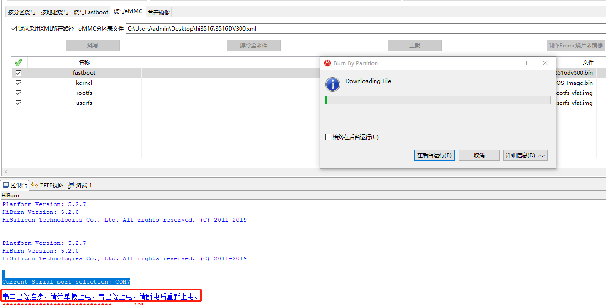
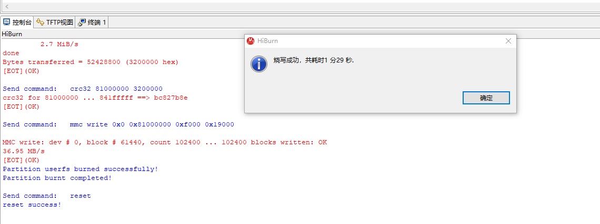
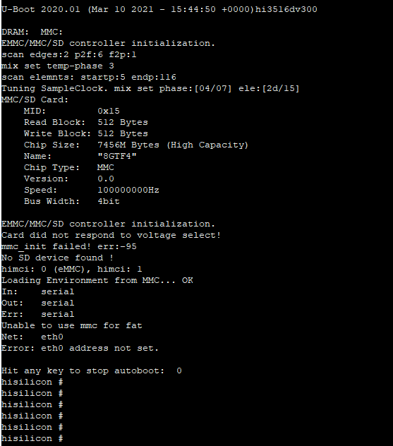
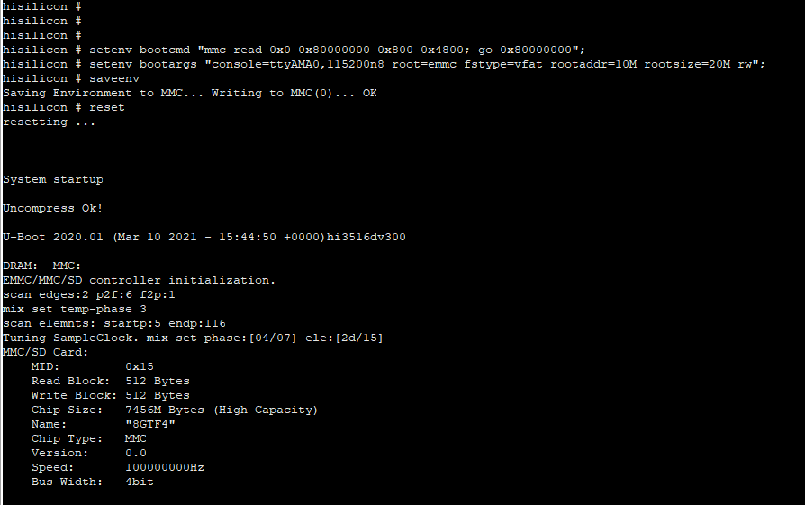

# 智能电子牌简介

### 一. 概述

本demo是基于hi3516dv300开发板，使用开源鸿蒙OpenHarmony 开发的应用。通过该应用不仅可以查看时间、日期以及对应的室内外温湿度、空气质量等，还可以查看当日的行程，让我们随时随地把握行程，不会遗漏任何重要的安排。


#### 1. 应用运行效果图：

​	

​	左边栏显示的是实时时间以及当天天气相关的信息。

​	右边显示的是当天日期以及日程列表，日程包含了日程的名字，以及开始时间及日程的内容。


#### 2.  设备与手机间交互示意图



如上图所示，当手机端创建日程后会将相关日程信息发送到云端，智能电子牌是通过HTTP协议主动从云端获取所有的日程信息。


### 二.  快速上手

#### 1. 开发环境准备

##### 	硬件准备

 1）预装windows系统的PC机

 2）Hi3516DV300 IoT Camera开发板

 3）USB转串口线、网线（Windows工作台通过USB转串口线、网线与Hi3516DV300 开发板连接）


其中Hi3516开发板介绍参照文档：[Hi3516开发板介绍](https://gitee.com/openharmony/docs/blob/OpenHarmony_1.0.1_release/zh-cn/device-dev/quick-start/Hi3516%E5%BC%80%E5%8F%91%E6%9D%BF%E4%BB%8B%E7%BB%8D.md)

淘宝店Hi3516DV300开发板购买地址：[HiSpark Taurus AI Camera(Hi3516d)开发板套件](https://item.taobao.com/item.htm?spm=a1z10.3-c.w4002-18447093278.18.46a24c57weAWXH&id=622922688823&mt=)


##### Linux编译服务器基础环境准备

开发基础环境由windows 工作台和Linux 编译服务器组成。windows 工作台可以通过samba 服务或ssh 方式访问Linux编译服务器。其中windows 工作台用来烧录和代码编辑，Linux编译服务器用来编译OpenHarmony代码，为了简化步骤，Linux编译服务器推荐安装Ubuntu20.04。


###### 安装和配置Python

1) 打开Linux终端。

   

2) 输入如下命令，查看python版本号，需要使用python3.7以上版本,否则参考 [系统基础环境搭建](https://gitee.com/openharmony/docs/blob/OpenHarmony_1.0.1_release/zh-cn/device-dev/quick-start/搭建系统基础环境.md)。

   ```
   python3 --version
   ```

   

3) 安装并升级Python包管理工具（pip3）。

   ```
   sudo apt-get install python3-setuptools python3-pip -y
   sudo pip3 install --upgrade pip
   ```


###### 安装hb

1. 运行如下命令安装hb。

   ```
   python3 -m pip install --user ohos-build
   ```

   

2. 设置环境变量。

   ```
   vim ~/.bashrc
   ```

   将以下命令拷贝到.bashrc文件的最后一行，保存并退出。

   ```
   export PATH=~/.local/bin:$PATH
   ```

   执行如下命令更新环境变量。

   ```
   source ~/.bashrc
   ```

   

3. 执行"hb -h"，有打印以下信息即表示安装成功。

   ```
   usage: hb
   
   OHOS build system
   
   positional arguments:
     {build,set,env,clean}
       build               Build source code
       set                 OHOS build settings
       env                 Show OHOS build env
       clean               Clean output
   
   optional arguments:
     -h, --help            show this help message and exit
   ```

   

##### Hi3516开发环境准备

######  将Linux shell改为bash

查看shell是否为bash，在终端运行如下命令

```
ls -l /bin/sh
```

如果显示为“/bin/sh -> bash”则为正常，否则请按以下方式修改：

```
sudo rm -rf /bin/sh
sudo ln -s /bin/bash /bin/sh
```


######  安装编译依赖基础软件（仅Ubuntu 20+需要）

```
sudo apt-get install build-essential && sudo apt-get install gcc && sudo apt-get install g++ && sudo apt-get install make && sudo apt-get install zlib* && sudo apt-get install libffi-dev
```


######  安装文件打包工具

1. 打开Linux编译服务器终端。

2. 运行如下命令，安装dosfstools。

   ```
   sudo apt-get install dosfstools
   ```

3. 运行如下命令，安装mtools。

   ```
   sudo apt-get install mtools
   ```

4. 运行如下命令，安装mtd-utils。

   ```
   sudo apt-get install mtd-utils
   ```

   

######  安装hc-gen

1. 打开Linux编译服务器终端。

2. 下载hc-gen工具。点击[下载地址](https://repo.huaweicloud.com/harmonyos/compiler/hc-gen/0.65/linux/hc-gen-0.65-linux.tar)下载。

3. 解压hc-gen安装包到Linux服务器~/hc-gen路径下。

   ```
   tar -xvf hc-gen-0.65-linux.tar -C ~/
   ```

4. 设置环境变量。

   ```
   vim ~/.bashrc
   ```

   将以下命令拷贝到.bashrc文件的最后一行，保存并退出。

   ```
   export PATH=~/hc-gen:$PATH
   ```

5. 使环境变量生效。

   ```
   source ~/.bashrc
   ```

   

######  安装Java 虚拟机环境

1. 打开Linux编译服务器终端。

2. 安装Java运行时环境（JRE）。

   ```
   sudo apt-get install default-jre
   ```

3. 安装Java sdk开发工具包。

   ```
   sudo apt-get install default-jdk
   ```


PS:

​	java虚拟机是应用签名打包时才会用到的，SDK中默认的3个系统应用是需要签名打包，所以需要安装java虚拟机，没有安装的话，应用签名打包时会报如下错误：


如果不涉及到应用的签名打包，可以不用安装此环境。

##### 	源码下载&&编译准备

环境搭完后，就该准备代码了。

OpenHarmony源码下载方法多种多样，本文重点介绍linux + repo方式下载。


###### 下载repo

```
#curl https://gitee.com/oschina/repo/raw/fork_flow/repo-py3 > /usr/local/bin/repo
#chmod a+x /usr/local/bin/repo
#pip3 install -i https://pypi.tuna.tsinghua.edu.cn/simple requests
```


###### 下载OpenHarmony源码

```
#特别注意：请下载OpenHarmony 1.0.1 版本，后续会更新支持OpenHarmony其他版本
#repo init -u git@gitee.com:openharmony/manifest.git -b OpenHarmony_1.0.1_release --no-repo-verify
#repo sync -c
#repo forall -c 'git lfs pull'
```


###### 下载智能电子牌代码

具体仓库地址: [knowledge_demo_smart_home](../../team_x/electronic_board)

通过git命令下载(方便后期代码上传管理，建议先将仓库fork到自己账号目录，然后再下载)：

```
git clone git@gitee.com:xxxxxxx/knowledge_demo_smart_home.git

其中xxxxxxx为fork后相关账号名字。
```


###### 代码拷贝

a. 在OpenHarmony的vendor目录下新建一个team_x的目录：

```
mkdir vendor/team_x
```



b. 将下载的智能电子牌的代码拷贝到新建的team_x下面：

```
cp -rf ../knowledge_demo_smart_home/dev/team_x/electronic_board/ vendor/team_x/
```






到此，代码就准备完成，可以进行编译了。


####  2. 代码编译

##### 	代码目录结构

​	在编译代码前，可以先了解一下代码目录结构：

```
|—— BUILD.gn							// 编译脚本
|—— res									// 资源文件
|—— config.json							// 安装包所需要的json文件
|—— include
|	|—— electronic_board_ability.h		// 入口类的头文件
|	|—— electr_board_ability_slice.h	// 主页面的头文件
|	|—— shcedule_list_view.h			// 日程列表显示类的头文件
|	|—— weather_time_view.h				// 天气以及时间显示类的头文件
|	|—— native_base.h					// 基类的头文件
|	|—— event_listener.h				// 事件定义及实现的类
|	|—— ui_config.h						// 界面相关坐标定义的头文件
|	|—— schedule_server.h				// 日程服务相关定义的头文件
|	|—— schedule_info.h					// 日程内容类的头文件
|	|—— common.h						// 天气获取相关定义的头文件
|	|—— sntp.h							// 时间获取相关定义的头文件
|	|__ LinkList.h						// 链表相关定义的头文件
|
|__ src
	|—— electronic_board_ability.cpp	
	|—— electr_board_ability_slice.cpp	// 主页面相关实现
	|—— schedule_list_view.cpp			// 日程列表显示类的实现
	|—— weather_time_view.cpp			// 天气以及时间显示类的实现
	|—— common.c						// 天气获取以及解析的实现
	|—— schedule_server.c				// 日程服务获取的显示
	|—— sntp.c							// 网络实时时间获取的实现
	|__ LinkList.c						// 链表的实现
```


#####  代码编译

​	源码和环境准备完后，接下来就是编译，编译涉及的指令有2条，hb set和hb build -f 。

​	hb set 	-- 	设置工程目录和选择对应的目标，通过键盘的上下键来选择。

​		

​		hb build -f  -- 开始全量编译。（hb build 为增量编译）

​	   

​	   编译完后会生成对应整个系统固件(u-boot-hi3516dv300.bin,OHOS_Image.bin, rootfs_vfat.img, userfs_vfat.img)以及我们应用对应的so文件。

其中u-boot-hi3516dv300.bin在device/hisilicon/hispark_taurus/sdk_liteos/uboot/out/boot/：


OHOS_Image.bin, rootfs_vfat.img,以及userfs_vfat.img在out目录下：


应用对应的so文件在out目录下的libs/usr/下面：


以下表格为所有生成的固件及对应的位置：

| 生产固件及应用文件的名称 | 对应文件路径                                               | 文件说明               |
| ------------------------ | ---------------------------------------------------------- | ---------------------- |
| u-boot-hi3516dv300.bin   | device/hisilicon/hispark_taurus/sdk_liteos/uboot/out/boot/ | 系统启动引导程序       |
| OHOS_Image.bin           | out/hispark_taurus/electronic_board/                       | 系统内核固件           |
| rootfs_vfat.img          | out/hispark_taurus/electronic_board/                       | 文件系统               |
| userfs_vfat.img          | out/hispark_taurus/electronic_board/                       | 用户数据分区           |
| libelectrBoard.so        | out/hispark_taurus/electronic_board/libs/usr/              | 智能电子牌应用的库文件 |


#### 3. 固件烧录

##### 	烧录工具选择

​	固件编译完后，是需要烧录到单板的。这里我们用的是HiTool工具烧录的。(HiTool工具下载地址:[HiHope官网](http://www.hihope.org/download/download.aspx?mtt=33))


##### 	烧录步骤

​	打开HiTool工具，如下图：


   烧写步骤按照图中标注即可。点击烧入后，烧录工具会提示重新上电，此时重启单板即可。




##### 烧录结果

烧录成功后，会弹出如下提示，单板也会自行启动。



烧录失败的话需要根据失败提示查找一下原因。一般情况需要检查一下串口是否连接正常，网线是否正确插入，IP是否选择正常等。

查看IP的方法：当单板上电后并正确插入网线后，点击工具上刷新按钮，此时单板IP会自动添加到服务器IP列表中。


##### IDE烧录

另外，OpenHarmony官网有提供一种通过IDE来烧录的，具体烧录步骤请参考文档：[3516上快速运行Hello OHOS](https://gitee.com/openharmony/docs/blob/master/zh-cn/device-dev/quick-start/quickstart-lite-steps-hi3516-running.md)。


##### 特别说明

如果是第一次烧录程序的话，单板在启动的时候需要设置bootargs，否则不能正常启动。单板第一次启动会停在hisilicon界面：



我们需要输入以下指令：

```
setenv bootcmd "mmc read 0x0 0x80000000 0x800 0x4800; go 0x80000000";
setenv bootargs "console=ttyAMA0,115200n8 root=emmc fstype=vfat rootaddr=10M rootsize=20M rw";
saveenv
reset
```



​	到此，烧录已经完成，设备也正常启动。


#### 4. 应用安装

##### 	打包应用

​	本demo是以安装包的形式安装到系统中启动运行的。因此，在安装应用前，需要将应用打包成安装包。

​	将编译好的libelectrBoard.so文件与工程目录下的res以及config.json文件通过压缩打包成zip格式(三个文件直接压缩，不能压缩文件夹)，并将后缀名改为hap(electrBoard.hap)。

​	

##### 	挂载NFS

​	 应用打包后，我们是通过NFS方式将单板挂载到本地，通过相关的指令来安装的，NFS挂载方法参照社区文章：[Hi3516通过NFS挂载方式与Windows共享文件](https://harmonyos.51cto.com/posts/3078)。

​		


##### 	 安装

​	  通过nfs是单板连接到本地电脑后，我们可以通过bm安装指令进行安装。bm 安装工具在系统编译完后会自动生成，路径在:

```
out/hispark_taurus/electronic_board/dev_tools/bin/
```

​			

​		由于bm默认安装的应用为已经签名的应用，所以我们在安装前需要先将签名去掉。

```
	bm set -s disable				// 去签名
	bm install -p filename			// 安装应用filename， filename需要指定路径
```

​			

​	 	安装完后桌面会显示对应应用的ICON，直接点击ICON即可以启动电子牌应用。

​			


#### 5. 使用指南


1. 设备启动后，桌面会有setting，camera，gallery以及electrboard等应用图标显示。其中setting，camera，gallery为系统应用。
2. 因为电子牌应用是通过网络获取时间以及天气信息，所以使用电子牌前需要先通过setting来配置网络。
3. 网络配置成功后点击桌面electrboard，电子牌应用即启动成功。此时通过电子牌可以查看到当前时间，天气以及对应当天的日程安排。

