# 设备连接IoT云平台指南

### 一、简介

设备与IoT云间的通讯协议包含了MQTT，LwM2M/CoAP，HTTP/HTTP2，Modbus，OPC-UA，OPC-DA。而我们设备端与云端通讯主要用的协议是MQTT。那么设备端与IoT云间是如何创建通信的呢？以连接华为云IoT平台为例：开发者需先在华为云IoT平台上创建产品并注册对应的设备，华为云IoT平台会分配给设备一个设备ID，并允许开发者设置一个验证码，端侧设备需使用设备ID和验证码来确保安全可信的连接到华为云IoT平台。
连接华为云IoT平台后，设备端与华为云IoT平台主要有两种通信方式。当设备侧状态发生变化时，设备可以向IoT平台上传设备状态，手机侧APP通过中间服务器向IoT平台查询设备状态，IoT平台将最新的设备状态下发至手机，则此时手机APP显示的设备侧状态与设备侧实际状态完成同步（如下图6、7、8所示）；用户操作手机APP时，手机APP通过中间服务器将用户命令发送给IoT平台，IoT平台将命令下发至设备侧，设备侧接收到命令后进行响应，则此时用户完成了一次对设备的控制（如下图9、10、11所示）。

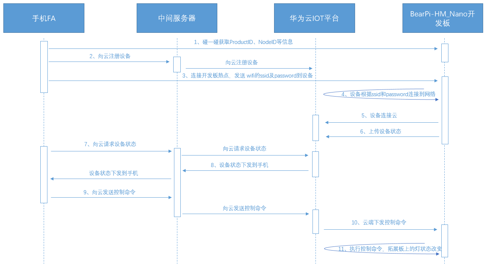

本章将介绍：1.如何在华为云IoT后台配置一个设备。2.设备端该如何使用SDK提供的IoT云相关的API接口来连接华为云IoT平台以及如何与华为云IoT平台通信。以帮助读者搭建从设备到云端的双向通信。

### 二、具体步骤

#### 1.  开发流程

开发者从获取硬件环境到设备连接到华为云IoT平台，可总结为下图所示流程：

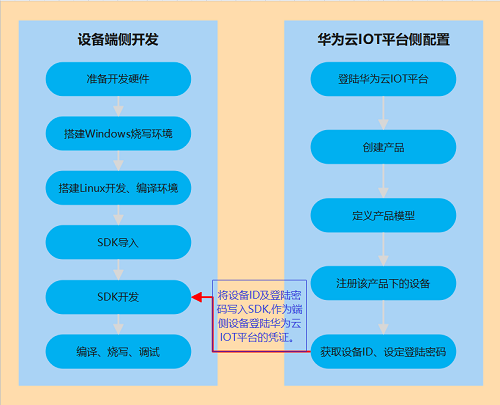

#### 2.  华为云IoT平台配置

#####     1.登陆华为云IoT平台后台

登录华为云IOT平台，进入到华为IoTDA界面，登陆网址[链接](https://www.huaweicloud.com/product/iothub.html)。

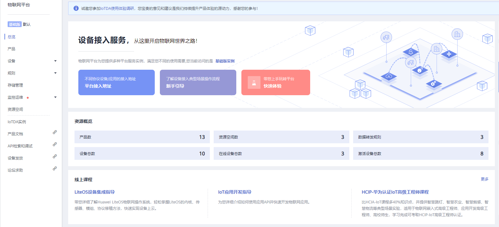

#####     2.创建产品

点击左侧功能页面选择栏中的产品页面，进入平台产品功能页面。		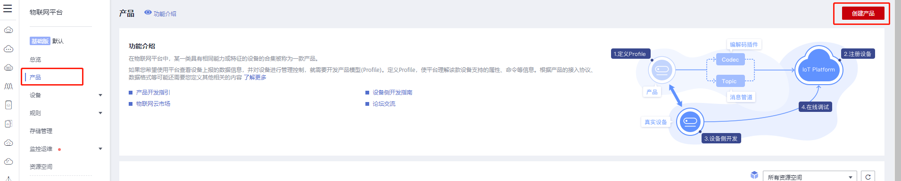       

点击页面右上角创建产品按钮，弹出创建产品窗口，根据提示填写对应信息。以风扇为例:

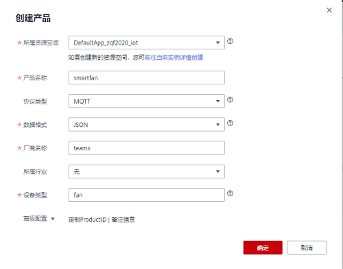

信息填写完成后可在产品信息列表中看到对应的产品信息

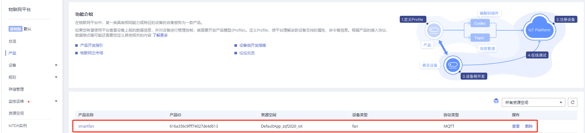

创建产品详细步骤[参考](https://support.huaweicloud.com/devg-iothub/iot_01_0053.html)

##### 3.定义产品模型

点击产品信息中的查看选项，可以进入到产品详细信息界面，在模型定义选项卡中选择自定义模型（也可以上传之前定义好的模型）

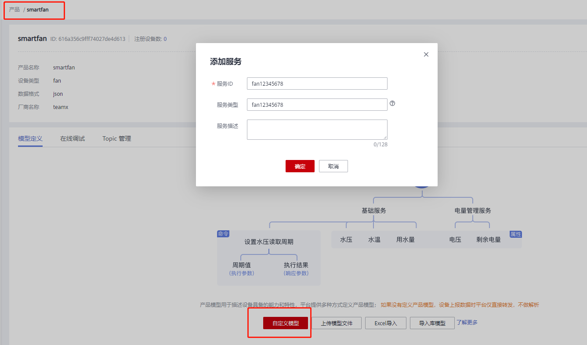

创建模型后就可以根据需要新建相关的命令以及属性。

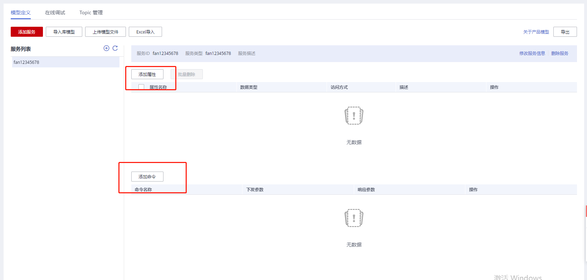

添加命令：

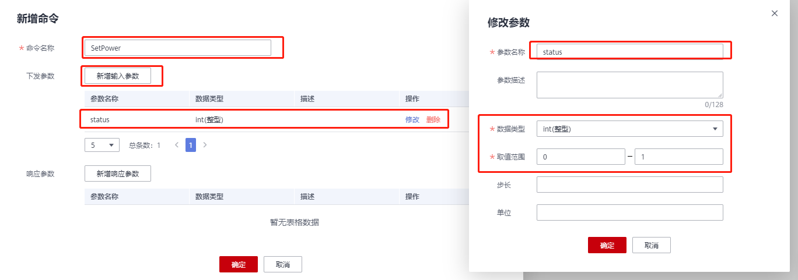

添加属性：

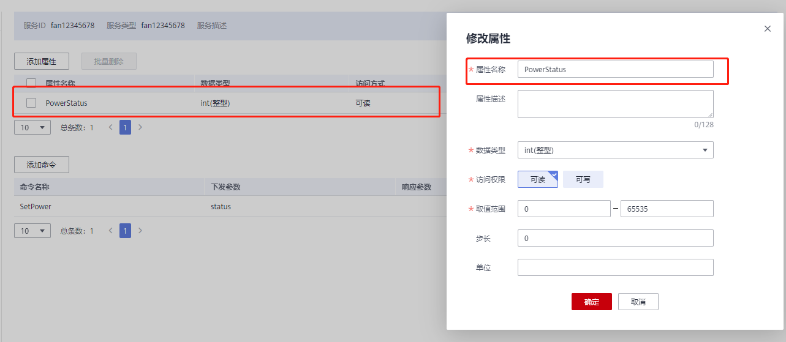

设备模型的详细操作[参考](https://support.huaweicloud.com/devg-iothub/iot_02_0005.html)

##### 4.注册设备

点击左侧功能页面选择栏中的设备->所有设备页面。点击页面右上角的注册设备按钮弹出单设备注册窗口。填写设备注册信息并设定验证码，单击确定完成设备注册。注册完后会提示保存设备ID与验证码，该设备ID和验证码在设备端开发时需要用到。

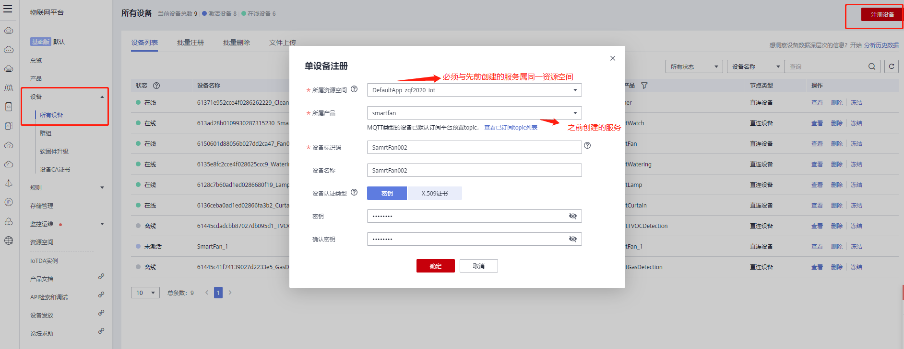

保存的设备ID和验证码：

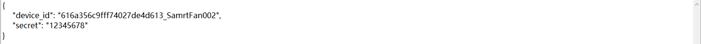

到此，IOT云平台配置完成。

#### 3. 华为云IoT设备端SDK开发

华为云IoT平台的端侧SDK已经集成到我们的SDK云通信模块中，开发者基于我们的SDK云通信模块提供的接口就可以与华为云IoT平台进行通信了。

##### 1.云通信模块对华为云SDK的封装

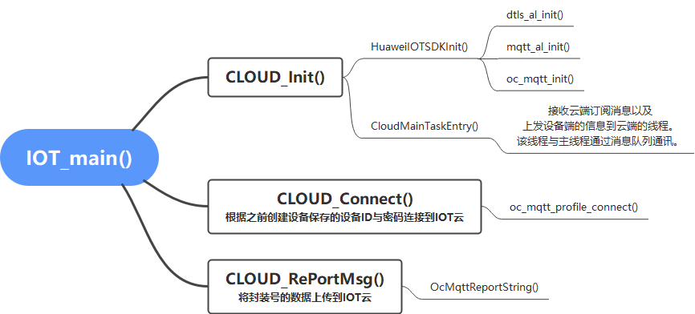

云通信模块封装的相关接口说明：

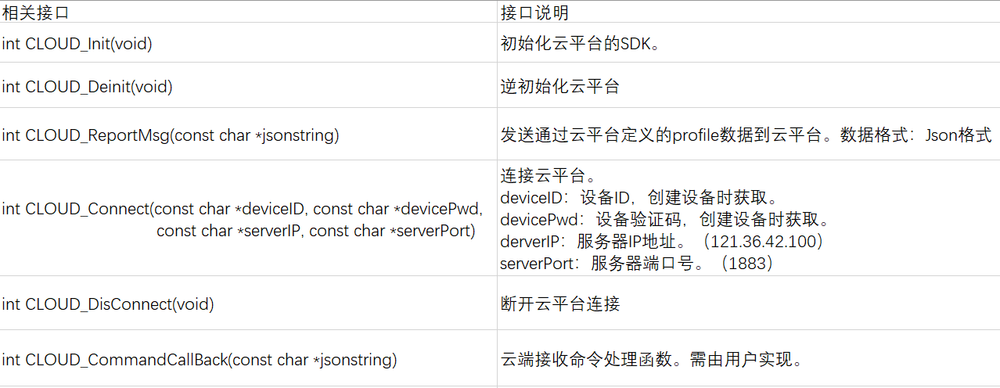

##### 2.云通信模块运行流程图

&nbsp;&nbsp;&nbsp;&nbsp;&nbsp;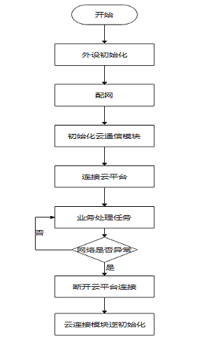

##### 3.云通信模块接口的使用方法

###### 1.云通信模块初始化

在调用云通信模块其他接口前必须先成功调用CLOUD_init，以确保云通信模块的初始化。

```
// 云通信模块初始化
if (CLOUD_Init() != 0) {  
    return;
}
```

###### 2.连接华为云IoT平台

在与华为云IoT平台通信前，需调用CLOUD_Connect连接华为云IoT平台。在对华为云IoT平台配置时，由平台分配的Device ID和验证码需传入此接口，用以确保安全可信的接入华为云IoT平台。

```
// 连接华为云IoT平台
nfcInfo.deviceID = "6150601d88056b027dd2ca47_Fan01";    // 云平台配置时分配的设备ID
nfcInfo.devicePWD = "12345678";     // 云平台配置时设置的验证码
if (CLOUD_Connect(nfcInfo.deviceID, nfcInfo.devicePWD, \    
    CONFIG_CLOUD_DEFAULT_SERVERIP, CONFIG_CLOUD_DEFAULT_SERVERPORT) != 0) {
    return;
}
```

###### 3.设备状态数据打包

在业务处理任务中，开发者需按照在华为云IoT平台后台申请的产品属性的格式，将设备当前状态上报至华为云IoT平台。以风扇为例，在定义产品模型时，定义如下属性：

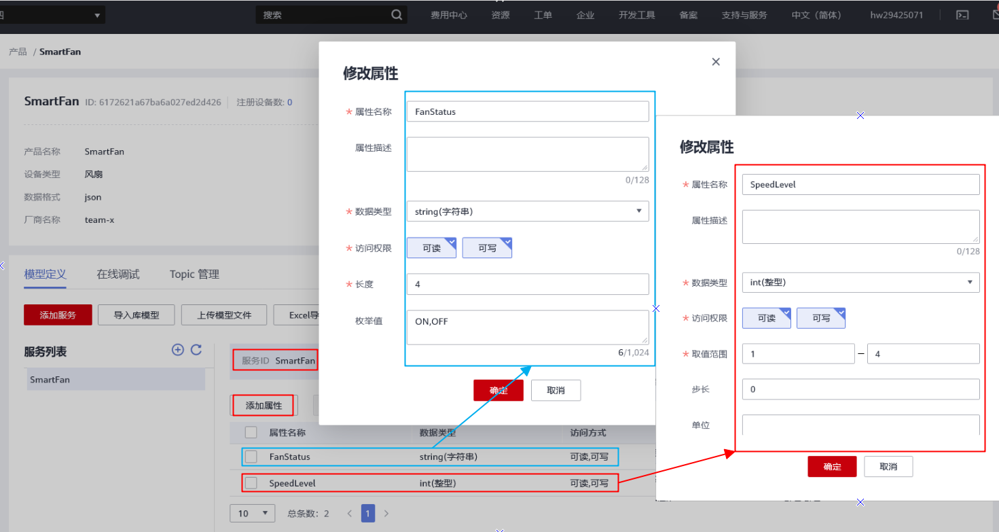

则，设备端对应上报数据的格式为：

```
{
	"service_id":"SmartFan",   // 产品服务ID，固定
	"data":{
		"FanStatus":"ON",        // 当前状态，类型string, 取值为“ON”(打开)、“OFF”(关闭)
		"SpeedLevel": 1,          // 当前设置风速风速(int 类型), 取值1-4
	}
}
```

其中FanStatus的ON与OFF，SpeedLevel的取值要反应端侧设备的实际状态。

为方便开发者，在云通信模块中，针对JSON格式数据的打包过程封装了IoTProfilePackage函数。在该函数中，通过IotProfileService、IotProfileKV两个结构体，分别将开发者在云平台中申请的不同ServiceID级别数据和属性级别数据组织了起来。

```
typedef struct {
    void                 *nxt;   ///< ponit to the next key
    char                 *key;
    IotProfileDataType    type;
    void                 *value;
}IotProfileKV;
```

```
typedef struct {
    void *nxt;
    char *serviceID; ///< the service id in the profile, which could not be NULL
    char *eventTime; ///< eventtime, which could be NULL means use the platform time
    IotProfileKV *propertyLst; ///< the property in the profile, which could not be NULL
} IotProfileService;
```

开发者仅需将在华为云IoT平台上配置的产品模型数据按照提供的两个结构体组织起来传入IoTProfilePackage函数，该函数便直接返回了上报的JSON数据。

```
IotProfileService  service;    // 定义ServiceID级别数据，该处对应云平台配置的SmartFan服务下的数据
IotProfileKV  kvFanSpeedLevel;   // 定义属性级别数据，该处对应云平台配置的属性SpeedLevel信息
IotProfileKV  kvMainFanStatus;   // 定义属性级别数据，该处对应云平台配置的属性FanStatus信息
    
 /* package the data */
 service.eventTime = NULL;
 service.serviceID = "SmartFan";     // 对应云平台配置的服务ID
 service.propertyLst = &kvMainFanStatus;    // 在SmartFan服务下添加属性信息
 service.nxt = NULL;    // 该产品上报数据中仅存在SmartFan一种服务，所以next指针为空

 kvMainFanStatus.key = "FanStatus";    // 对应云平台配置的属性名称
 kvMainFanStatus.value = mainFanStatus ? "ON" : "OFF";    // FanStatus的ON,OFF取值由设备实际                                                           // 状态mainFanStatus决定。
 kvMainFanStatus.type = IOT_PROFILE_KEY_DATATYPE_STRING;    // 对应云平台配置的数据类型
 kvMainFanStatus.nxt = &kvFanSpeedLevel;     // 继续添加SmartFan服务下的另一属性。

 kvFanSpeedLevel.key = "SpeedLevel";     // 对应云平台配置的服务ID
 kvFanSpeedLevel.value = &speedLevel;    // speedLevel的取值由设备实际状态speedLevel决定。
 kvFanSpeedLevel.type = IOT_PROFILE_KEY_DATATYPE_INT;    // 对应云平台配置的数据类型
 kvFanSpeedLevel.nxt = NULL;   // SmartFan服务下没有其它属性了，next置为null。 
 
 jsonString = IoTProfilePackage(&service);  //打包本地数据，函数返回打包好的数据
```

###### 4.设备状态数据上报

将端侧设备的实际状态打包成JSON格式的上报数据后，便可调用CLOUD_ReportMsg函数，将数据上报至华为IoT云平台。

```
if ( NULL != jsonString) {    // jsonString为打包好的上报数据
     RaiseLog(LOG_LEVEL_INFO, "jsonString:%s", jsonString);
     ret = CLOUD_ReportMsg(jsonString);
     free(jsonString);
} else {
     RaiseLog(LOG_LEVEL_ERR, "format the report message error");
}
```

###### 5.设备端通知数据上报

在一些场景下，设备端有一些自定义的通知信息需要通知到用户。此类信息仅需透传至手机应用侧即可而不需要华为云IoT平台对数据进行解析。像燃气报警装置的报警信息、甲醛监测装置的报警信息等都属于设备端通知数据的上报，此时开发者可以调用CLOUD_ReportNotification进行此类数据的上报。该函数入参中第一项定义了通知信息的种类，第二、三项分别为通知信息的中、英文字符串。

```
typedef enum {
    NOTIFY_TYPE_NORMAL = 0,
    NOTIFY_TYPE_SECONDARY,
    NOTIFY_TYPE_URGENT,
    NOTIFY_TYPE_LAST
} NOTIFY_TYPE;

int CLOUD_ReportNotification(int type, const char *enString, const char *chString);
```

以燃气报警设备为例，当设备端检测到燃气浓度超标时，则调用如下接口将通知数据进行上报：

```
CLOUD_ReportNotification(NOTIFY_TYPE_URGENT, "Gas warning", "可燃气体警告");
```

###### 6.云端命令的下发与解析

为将云端下行数据通知到用户，在云通信模块中声明了CLOUD_CommandCallBack函数：

```
int CLOUD_CommandCallBack(const char *jsonString);
```

该函数需由开发者进行实现，当云端有下行数据发送至端侧设备时，云通信模块会通过调用此函数将数据传输给开发者，再由开发者对此数据进行解析。具体实现是：调用此函数时将云端下行数据的指针传入函数，开发者在函数内部实现对下行数据的解析。以风扇为例，在定义产品模型时，定义如下命令：

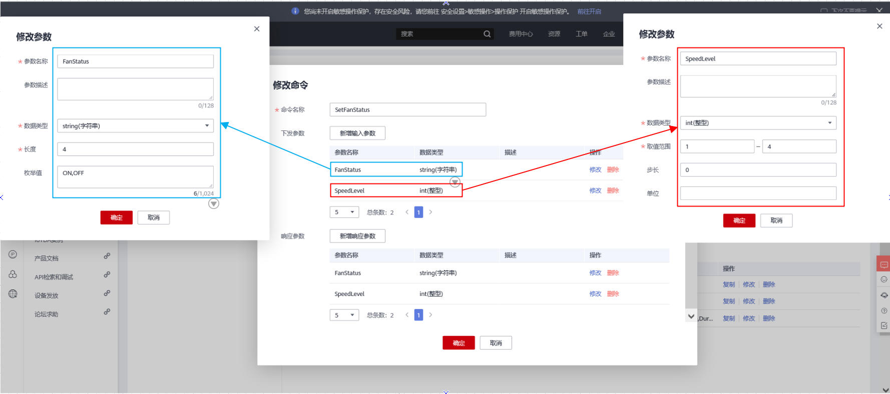

则云端下发命令格式为：

```
 {
	"service_id":"SmartFan",       // 产品服务ID，固定
	"command_name":"SetFanStatus", // 开关命令名字，固定
	"paras":{
		"FanStatus":"ON",           // 命令参数,控制风扇开关,类型(string)，选项为ON（打开）/OFF(关闭)
		"SpeedLevel":1,              // 命令参数,风扇挡位(int 类型)， 1 - 4   1：风速最小
	}
}
```

则在函数中对其进行解析：

```
// 按照cJSON结构体的结构序列化整个数据包
if ((objRoot = cJSON_Parse(jsonString)) == NULL) {    
    RaiseLog(LOG_LEVEL_ERR, "could not parse the payload\r\n");
    goto EXIT_JSONPARSE;
}
// 查找 command_name对象
if ((objCmdName = cJSON_GetObjectItem(objRoot, "command_name")) == NULL) {    
    RaiseLog(LOG_LEVEL_ERR, "%s:could not get the cmd name from json\r\n");
    goto EXIT_CMDOBJ;
}
// 在command_name对象查找SetFanStatus字符串，若查找到则调用DealSetFanStatus进行解析
if (0 == strcmp(cJSON_GetStringValue(objCmdName), "SetFanStatus")) {
    ret = DealSetFanStatus(objRoot);
} 
```

经过层层解析，最终解出对应的命令，并设置到端侧设备：

```
// 查找数据中FanStatus对象
if ((objPara = cJSON_GetObjectItem(objCmd, "FanStatus")) == NULL) {
    RaiseLog(LOG_LEVEL_ERR, "cJSON_GetObjectItem LampStatus failed!\n");
    return -1;
}
// 解析数据中FanStatus的键值ON或OFF并设置到端侧设备
if (0 == strcmp(cJSON_GetStringValue(objPara), "ON")) {
    setFanParam->status = CN_BOARD_SWITCH_ON;
}
else {
    setFanParam->status = CN_BOARD_SWITCH_OFF;
}
// 查找数据中SpeedLevel对象并在验证SpeedLevel的键值后设置到端侧设备。
if ((objPara = cJSON_GetObjectItem(objCmd, "SpeedLevel")) != NULL) {
    setFanParam->speedLevel = cJSON_GetNumberValue(objPara);
    if (setFanParam->speedLevel < 1) {
        setFanParam->speedLevel = 1;
    } else if (setFanParam->speedLevel >= 4) {
        setFanParam->speedLevel = 4;
    }
} 
```

本节仅以SetFanStatus命令为例，其他命令类似不再重述。

###### 7.断开华为云IoT平台连接

开发者可在网络异常或其它需要断开与云端连接的场景下，调用如下接口断开与云端连接。

```
int CLOUD_Disconnect(void);
```

###### 8.云通信模块逆初始化

在断开与云端的连接后需调用如下接口，以释放资源。

```
int CLOUD_Deinit(void);
```

### 三、总结

本章介绍了如何将一个具有网络功能的设备连接到华为云IoT平台上。在华为云IoT平台后台上配置一个设备，端侧SDK使用云通信模块接口实现连云、上报数据、接收和解析下发数据。读者还需参考设备如何接入互联网、手机应用侧开发等相关文档以更好地了解由手机应用、IoT云、端侧设备构成的整个系统的运作方式。
