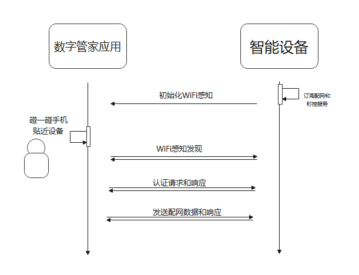
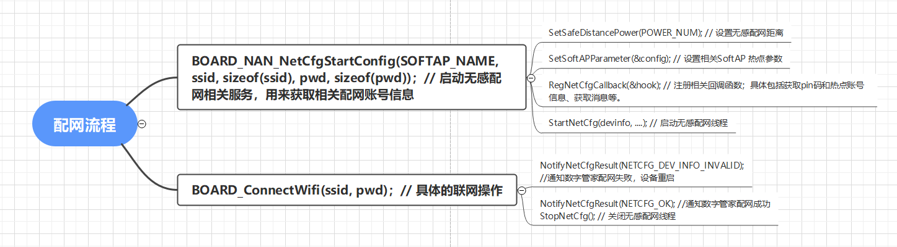
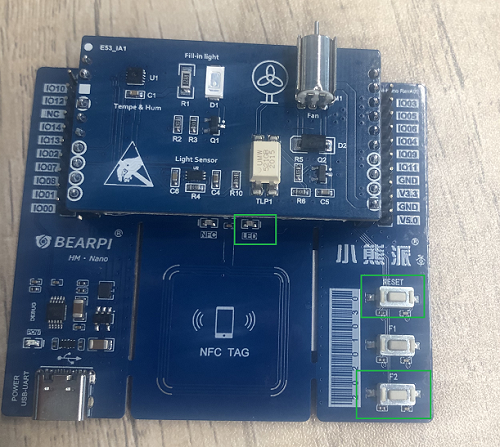

# 无感配网介绍

### 1、简介

```
无感配网是指在设备联网过程中无需输入热点相关账号信息，即可快速实现设备配网，是一种兼顾高效性、可靠性和安全性的配网方式。
```


## 2、配网原理

### 2.1 通信原理

```
    手机和智能设备之间的信息传递，利用特有的NAN协议实现。利用手机和智能设备之间的WiFi 感知订阅、发布能力，实现了数字管家应用和设备之间的发现。在完成设备间的认证和响应后，即可发送相关配网数据。同时还支持与常规SoftAP配网方式共存。
```




### 2.2 相关配网代码流程

```
相关代码：
teamX/common/iot_wifi/libs/libhilinkadapter_3861.a // 无感配网相关库文件
teamX/common/iot_wifi/libs/libnetcfgdevicesdk.a    // 无感配网相关库文件
teamX/common/inc/iot_netcfg_nan.h
teamX/common/inc/network_config_service.h // 无感配网相关头文件
teamX/common/iot_wifi/iot_wifi.c  // 相关联网接口
teamX/common/iot_wifi/iot_netcfg_nan.c // 无感配网相关实现
```

具体配网流程如下：




## 3、操作说明

### 3.1 配网准备

(1) 提前准备好一个可以正常联网的AP热点A，并确保安装数字管家应用的手机连接到该热点A上。
(2) 提前准备智能设备硬件，并下载相关设备侧代码。
(3) 编译相关智能设备软件，并烧录。备软件，并烧录。
(4)将配网信息写入设备侧NFC芯片（详细参考[NFC标签配置](https://gitee.com/openharmony-sig/knowledge_demo_smart_home/tree/master/dev/docs/NFC_label_definition)）。

### 3.2 配网操作

(1)  启动提前准备好的设备，或者按下设备对应配网按键后重启设备。

​      

配网说明：（以小熊派开发板为例）

如果是刷新固件后第一次重启，直接进入无感配网模式，此时LED灯以8times/S的频率闪烁，成功配网后以1times/S的频率闪烁。并且会同时保存配网数据到KV中，重启后无需重新配网； 如果需要更换账号密码，按下F2 按键不放，同时按下后放开RESET按键。待LED灯以8times/S 的频率闪烁时，放开F2 按键即可重新进入配网模式。

(2) 手机靠近设备NFC标签，进入手机配网页面。
(3) 待设备通过NAN协议获取手机中保存的热点A账号信息，并且进入联网动作。联网成功后自动进入数字管家的相关的控制页面。

