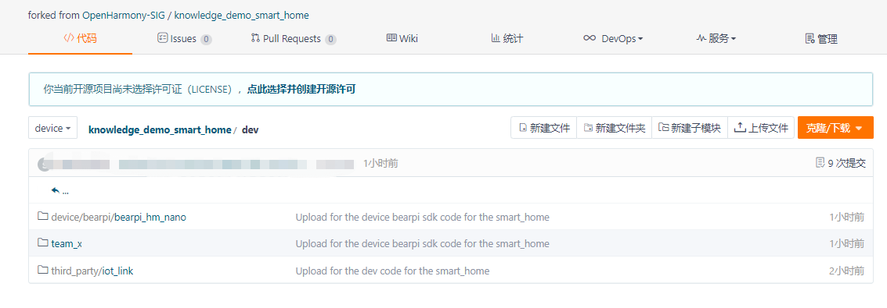
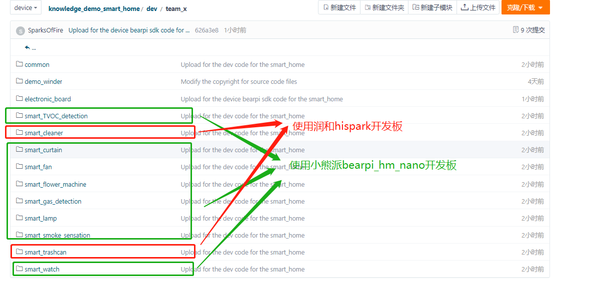

# 代码下载和编译准备

### 工具下载

```
#curl https://gitee.com/oschina/repo/raw/fork_flow/repo-py3 > /usr/local/bin/repo
#chmod a+x /usr/local/bin/repo
#pip3 install -i https://pypi.tuna.tsinghua.edu.cn/simple requests
```

## 代码下载

#### OpenHarmony 代码下载

```
#特别注意：请下载OpenHarmony 1.0.1 版本，后续会更新支持OpenHarmony其他版本
#repo init -u git@gitee.com:openharmony/manifest.git -b OpenHarmony_1.0.1_release --no-repo-verify
#repo sync -c
#repo forall -c 'git lfs pull'
```

OpenHarmony代码下载后，需要确保hb 编译命令的正常使用。

#### 设备侧代码下载

具体仓库地址：https://gitee.com/openharmony-sig/knowledge_demo_smart_home/

下载方式1：直接下载仓库对应zip 包文件

下载方式2：fork knowledge_demo_smart_home仓库后，使用git 命令下载


## 编译准备

#### 1、代码拷贝

将knowledge_demo_smart_home/dev 目录拷贝到 OpenHarmony1.0.1目录



1） 将上图中的bearpi/bearpi_hm_nano目录拷贝到 OpenHarmony1.0.1 根目录的device文件夹下；

2） 将上图中的team_x目录整体拷贝到 OpenHarmony1.0.1 根目录的vendor文件夹下;

3） 将上图中的iot_link目录整体拷贝到 OpenHarmony1.0.1 根目录的third_party文件夹下。


#### 2、OpenHarmony目录相关代码修改

  下图是有关设备侧样例使用的Hi3861开发板，对于不同的开发板， 需要在OpenHarmony目录下做对应的特定修改



#### 2.1 Hispark 开发板特定修改

2.1.1 修改usr_config.mk 文件

地址：device/hisilicon/hispark_pegasus/sdk_liteos/build/config/usr_config.mk

```
使能如下配置项
CONFIG_I2C_SUPPORT=y
CONFIG_PWM_SUPPORT=y
```

2.1.2 修改wifiservice 文件夹

地址：device/hisilicon/hispark_pegasus/hi3861_adapter/hals/communication/wifi_lite/wifiservice/source/wifi_hotspot.c

```
EnableHotspot函数中屏蔽如下字段
139     //if (SetHotspotIpConfig() != WIFI_SUCCESS) {
140     //    return ERROR_WIFI_UNKNOWN;
141     //}
```

地址：device/hisilicon/hispark_pegasus/hi3861_adapter/hals/communication/wifi_lite/wifiservice/source/wifi_device.c

```
DispatchConnectEvent函数下 屏蔽StaSetWifiNetConfig相关代码行
239         //StaSetWifiNetConfig(HI_WIFI_EVT_CONNECTED);
260        //StaSetWifiNetConfig(HI_WIFI_EVT_DISCONNECTED);
```


#### 2.2 BearPi-HM_nano 开发板特定修改

修改 build/lite/components/vendor.json文件，在component "hi3861_sdk " 后添加如下 成员 bearpi_hi3861_sdk

```
 {
   "component": "bearpi_hi3861_sdk",
   "description": "",
   "optional": "false",
   "dirs": [
    "device/bearpi/bearpi_hm_nano/sdk_liteos"
   ],
   "targets": [
    "//device/bearpi/bearpi_hm_nano/sdk_liteos:wifiiot_sdk"
   ],
   "rom": "",
   "ram": "",
   "output": [],
   "adapted_board": [
    "hi3861v100"
   ],
   "adapted_kernel": [ "liteos_m" ],
   "features": [],
   "deps": {
    "components": [
     "utils_base"
    ]
   }
  },
```

