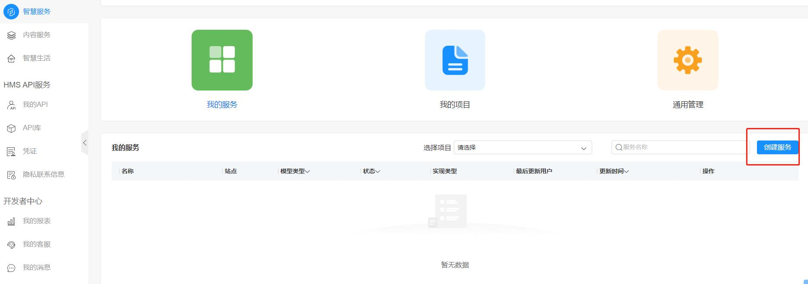

# 数字管家快速上手指南

下面以智能台灯设备为例，给大家介绍怎样快速上手体验数字管家

## 1、操作体验

##### 1.1 设备配网

1) 在设备上电前需准备好安装了数字管家应用的HarmonyOS手机，详情见本指南第5章数字管家应用编译、安装, 并在设置中开启手机的NFC功能；
2) 写设备NFC标签，详细操作见本指南第6章写NFC标签和配置应用服务关联章节;

3) 智能台灯烧录完成后，上电。详细操作见本指南第4章写NFC标签和配置应用服务关联章节，开发者在观察开发板上状态LED灯以８Hz的频率闪烁时，将手机上半部靠近开发板NFC标签处；

4) 无需任何操作手机将自动拉起数字管家应用并进入配网状态，配网过程中无需输入热点账号密码。 具体无感配网相关流程参考 [无感配网指南](../net_config/README.md)

&nbsp;


##### 1.2 设备控制

配网完成后，数字管家应用会自动进入智能台灯的控制页面，通过控制页面可以实现对智能台灯开关、亮度控制的操作。

&nbsp;


##### 1.3  添加日程

使用者可以进入数字管家的日程管理页面中添加智能台灯的相关日程，具体步骤如下：

1) 在输入日程名称后，选择相关通知成员和台灯设备；

2) 选择期待执行的台灯操作，例如：设置台灯在特定时间段内亮灯或关灯；

3) 设置日程的重复日期，例如：可以设置单次日程(仅在当天执行)，或者重复日程(设置日程在设定的 星期几重复执行)

&nbsp;

## 2、环境准备

##### 2.1 硬件准备

- HarmonyOS 手机一台，Harmony OS 版本2.0.0.168以上；

- BearPi-HM Nano主板+ E53-SC1拓展板（ [购买地址](https://item.taobao.com/item.htm?spm=a1z10.5-c-s.w4002-22244473708.15.305b5f69P3rzYw&id=633296694816)），如下图

  &nbsp;

##### 2.2 软件准备

-  DevEco studio 版本：推荐DevEco Studio 3.0 Beta1 版本或以上
-  在华为应用市场，下载并安装“应用调测助手”APP，用于写NFC标签。
- 打开手机**设置 > 应用和服务 > 应用管理** (点击右上角图标，点击显示系统程序选项)，搜索“智慧生活基础服务”，检测智慧生活基础服务的版本是否为12.0.2.306及以上。如果不是，请打开华为手机的“智慧生活”APP，点击“**我的 > 设置 > 检查应用更新**”，更新“智慧生活基础服务”。
- 确保HarmonyOS 手机中api version 在 API 6以上，查看HarmonyOS  手机API方法：在HarmonyOS SDK存储目录下的**Sdk\toolchains**文件下打开命令行工具，执行如下命令进行查询真机设备的apiversion和releaseType取值。

```
hdc shell 
getprop hw_sc.build.os.apiversion // 返回数值是6或者6以上
```

## 3、数字管家相关代码下载

##### 3.1 访问代码仓库

数字管家代码链接: https://gitee.com/openharmony-sig/knowledge_demo_smart_home

&nbsp;

##### 3.2  登录gitee账号

注册或者登录提前准备好的gitee 账号

##### 3.3  代码下载

方法一：点击克隆/下载按钮，下载数字管家相关仓库代码，并解压。

&nbsp;

方法二：fork数字管家仓库后，使用git 命令下载

```
git clone git@gitee.com:xxx/knowledge_demo_smart_home.git  // 其中xxx为你的gitee账号名字。
```

## 4、设备端代码烧录

##### 4.1 烧录工具下载

下载链接任选其一即可

[Hiburn链接1](https://harmonyos.51cto.com/resource/29)                                [Hiburn链接2](https://gitee.com/openharmony-sig/vendor_oh_fun/blob/master/bearpi-hm_nano-oh_flower/04_%E7%83%A7%E5%BD%95%E5%B7%A5%E5%85%B7/HiBurn.exe)

##### 4.2 USB转串口驱动安装

首先通过TypeC数据线，将电脑与设备连接。安装CH340驱动，
下载地址：http://www.wch.cn/search?q=ch340g&t=downloads
驱动安装成功后，打开window电脑计算机管理工具，查看开发板的串口，如下图

&nbsp;

##### 4.3 配置Hiburn工具

第一步：打开Hiburn工具，并点击`Refresh`，选择相应com，本示例中为com5和上图相匹配，如下图示

&nbsp;

第二步： 修改波特率，配置波特率为921600,如下图示

&nbsp;

第三步：选择烧录文件后下载：

烧录文件路径：步骤1.3中下载代码路径下，knowledge_demo_smart_home\dev\docs\quick_start\resource\image\

烧录文件名：Hi3861_wifiiot_app_allinone.bin

点击Hiburn工具中的Select file按钮，在弹出的文件框中，选择代码编译所生成的固件然后确认（下图中假设烧录文件在桌面上）；选中Auto burn按钮，然后点击connect按钮，等待下载，如下图

&nbsp;

按下设备上的复位(RESET)按钮，开始烧录固件，如下图所示

&nbsp;

等待进度条跑完，第二次出现“Execution Successful”字样后则表示烧录完成。
## 5、数字管家应用编译、安装

##### 5.1 DevEco Studio软件安装

第一步：DevEco Studio 软件下载

版本：DevEco Studio 3.0 Beta1

下载地址：https://developer.harmonyos.com/cn/develop/deveco-studio
&nbsp;
&nbsp;

第二步：解压下载的deveco-studio 安装包，双击安装deveco-studio-3.0.0.601.exe可执行文件。

在安装向导界面下，一直点击Next直到安装完成后点击Finish按钮。

第三步：安装完成后第一次启动deveco-studio，会提示是否下载OpenHarmony SDK ，如果需要则按照SDK setup 界面默认下载路径。勾选Accept签署协议后，下载OpenHarmony SDK。

##### 5.2 HarmonyOS SDK 下载

打开DevEco-studio, File -> Setting -> SDK Manager -> HarmonyOS Legacy SDK ->Platforms 页面中确保API6 相关sdk 已下载，如下图所示：

&nbsp;


##### 5.3  在AGC中创建应用

 AGC（AppGallery Connect) 地址：https://developer.huawei.com/consumer/cn/service/josp/agc/index.html#/

第一步：登录AGC平台，创建项目；

第二步：进入到你创建的项目里面，点击左上方的 添加应用按钮，填写相关信息后，点击确认即可;

&nbsp;


##### 5.4 更换数字管家应用包名

将如下文件中的bundleName由com.example.distschedule替换成为 步骤3.3中已注册的包名： com.keniotest.distschedule，

特别注意：数字管家中的应用包名必须与AGC中注册应用的包名一致，否则应用签名会失败。

```
./entry/src/config.json
./netconfig/src/main/config.json
./netconfig/src/main/js/default/pages/index/index.js
```


##### 5.5  配置应用签名信息

第一步：连接真机设备，确保DevEco Studio与真机设备已连接，真机连接成功后如下图所示
连接细节见：[DevEco Studio 与真机连接步骤文档](https://developer.harmonyos.com/cn/docs/documentation/doc-guides/run_phone_tablat-0000001064774652)

&nbsp;

使用如下命名查看手机UDID：在HarmonyOS SDK存储目录下的**Sdk\toolchains**文件下打开命令行工具，执行如下命令进行查询真机设备的UDID

```
hdc shell bm get -u
0A28E9E57A217FE0456799D6261632F7D5ED1347CBC420A47CFC341051372D21
*******  // UDID 为64位字串
```

第二步：DevEco Studio生成签名.p12和.csr密钥文件;

进入Build > Generate Key and CSR  
生成*.p12 密钥,细节如下
&nbsp;
生成*.csr 密钥,细节如下
&nbsp;

第三步：添加手机UDID 到AGC > 用户与访问 > 设备管理

[设备管理链接访问地址](https://developer.huawei.com/consumer/cn/service/josp/agc/index.html#/ups/9249519184596237893), 添加手机UDID到设备管理页面:
&nbsp;

第四步:  上传CSR密钥文件到AGC > 用户与访问 > 证书管理, 新增证书成功后下载对应cer文件
&nbsp;
&nbsp;

第五步:   从APC平台下载p7b 文件
AGC平台 > 我的项目 > HarmonyOS应用 > HAP Provision Profile 

类型选项: 选择调试选项 

选择证书选项: 选择第四步中添加的kenio_test证书 

选择设备选项: 选择第三步添加的真机设备

&nbsp;

第六步:    DevEco Studio 配置签名相关文件

DevEco Studio > File > Project Structure > Project >Signing Configs 页面中配置如下, 

Store file  *.p12:  该文件在第二步中生成;

pass word / Key alias / Key password : 均与第二步中的数据保持一致;

Profile file : 为第五步下载的文件;

Certpath file : 为第四步下载的文件.

&nbsp;


##### 5.6 数字管家安装运行

第一步：设置相关配置项

&nbsp;

因为数字管家应用分为entry 和netcfg 两个module，需要勾选 “Deploy Multi Hap Packages” 
&nbsp;

第二步：调试安装
&nbsp;

更多真机调试细节，请见[真机调试文档](https://developer.harmonyos.com/cn/docs/documentation/doc-guides/ide_debug_device-0000001053822404#section793484619307)

## 6、写NFC标签和配置应用服务关联

##### 6.1 申请Product ID

提前准备已满足环境准备条件的手机，登录你的华为账号，并在华为应用市场中下载安装应用调测助手软件。特别注意在下图中第四步中的应用名应该与步骤3.3 和步骤3.4 中保持一致。


##### 6.2  创建快服务

在管理中心页面中依次点击智慧服务->华为快服务智慧平台进入快服务智慧平台。



点击快服务模型，填写服务相关信息，点击创建按钮完成快服务模型的创建。

&nbsp;


##### 6.3 完善快服务相关信息

在服务信息栏下的基本信息页面完善快服务模型基本信息后，点击右上角保存按钮，保存快服务基本信息。


进入服务呈现信息页面完善相关信息（星标项目必填）服务大图标也要填，后续测试项需要，点击右上角保存按钮，保存服务呈现信息。


##### 6.4 录入快服务配置信息

点击配置栏，进行配置信息的填写。
HarmonyOS标签页面如下图，其中产品型号填写在步骤4.1 中应用调测助手中申请的Product ID 99HJ ，产品子型号填写00。

&nbsp;

FA信息页面填写信息如下图，其中App包名、服务名分别为FA开发中对应的IoT应用的包名，以及开发者期望通过NFC唤起的IoT应用的服务名（本项目唤起的服务为设备配网）。


##### 6.5 录入快服务测试信息

点击测试栏，进入快服务测试页面，进行测试相关信息的填写。


&nbsp;

第一步：点击创建进入创建真机测试名单窗口。

填写手机号码与描述后确认。

&nbsp;

 第二步：确认  该手机已经录入名单中；

 第三步：点击准备测试按钮。到此，应用功能唤起信息申请和配置完成。

##### 6.6 NFC数据写入

基于规则定义，写入NFC标签中的配网信息为：

1246128c7b60ad1ed0286680f19206Lamp01308123456784011512teamX-Lamp01

下面是标签内容解释：


NFC标签写入过程如下图所示：


