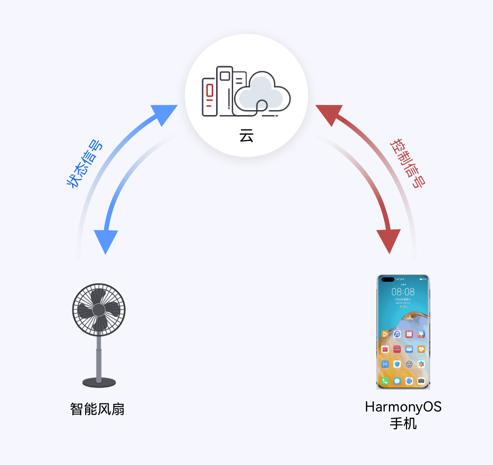
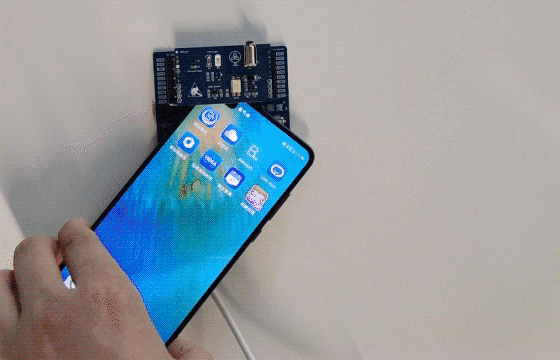
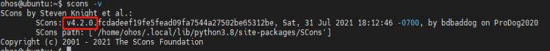
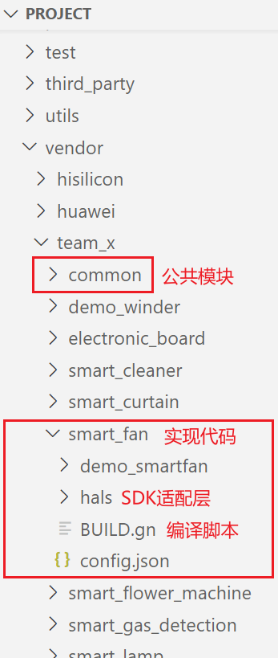
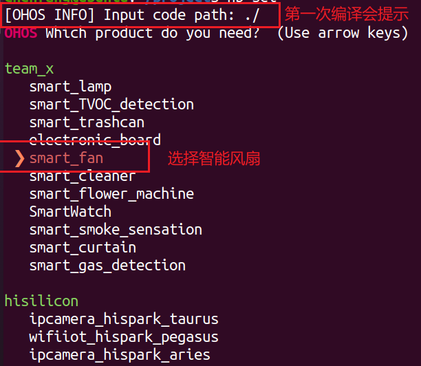
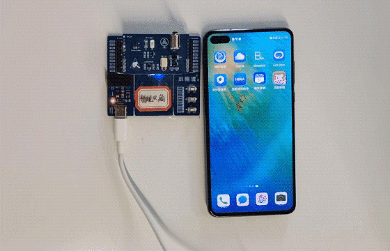
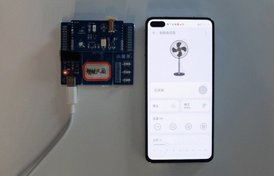

# 智能风扇

## 一、简介

​	     智能风扇设备不仅接收数字管家应用下发的指令来控制风扇开启的时间，调节风扇挡位，更改风扇定时时间，而且还可以加入到数字管家的日程管理中。通过日程可以设定风扇相关的任务，使其在特定的时间段内，风扇自动打开或者关闭，调节挡位大小和定时时间；通过日程管家还可以实现风扇和其他的智能设备联动。

#### 1.交互流程

&nbsp;

如上图所示，智能风扇整体方案原理图可以大致分成：智能风扇设备、数字管家应用、云平台三部分。智能风扇通过MQTT协议连接华为IoT物联网平台，从而实现命令的接收和属性上报。关于智能设备接入华为云IoT平台的详细细节可以参考 [连接IOT云平台指南](../iot_huawei/README.md)；智能设备同数字管家应用之间的设备模型定义可以参考[智能风扇profile定义](../../../profile/智能风扇profile定义.md) .

#### 2.实物简介

&nbsp;

我们使用小熊派bearpi_hm_nano开发底板+ E53_IA1拓展板来模拟智能风扇设备。 

通过PWM接口控制拓展板上的电机的工作状态模拟风扇工作；

reset按键控制设备重启；reset按键组合控制按键可以清除已保存的配网信息，具体操作：先按下控制按键F2，然后按下reset按键；

通过NFC模块实现设备碰一碰快速配网；

#### 3.实物操作体验

&nbsp;

## 二、快速上手

#### 1、硬件准备

BearPi-HM Nano套件一套（ [购买地址](https://item.taobao.com/item.htm?spm=a1z10.5-c-s.w4002-22244473708.12.5ad269e0zIq4JO&id=633296694816)）
预装HarmonyOS手机一台


#### 2、Linux编译服务器基础环境准备

开发基础环境由windows 工作台和Linux编译服务器组成。windows 工作台可以通过samba 服务或ssh 方式访问Linux编译服务器。其中windows 工作台用来烧录和代码编辑，Linux编译服务器用来编译OpenHarmony代码，为了简化步骤，Linux编译服务器推荐安装Ubuntu20.04。

###### 安装和配置Python

1) 打开Linux终端。

2) 输入如下命令，查看python版本号，需要使用python3.7以上版本,否则参考 [系统基础环境搭建](https://gitee.com/openharmony/docs/blob/OpenHarmony_1.0.1_release/zh-cn/device-dev/quick-start/%E6%90%AD%E5%BB%BA%E7%B3%BB%E7%BB%9F%E5%9F%BA%E7%A1%80%E7%8E%AF%E5%A2%83.md)。

   ```
   python3 --version
   ```

3) 安装并升级Python包管理工具（pip3）。

```
sudo apt-get install python3-setuptools python3-pip -y
sudo pip3 install --upgrade pip
```

###### 安装hb

1. 运行如下命令安装hb

   ```
   python3 -m pip install --user ohos-build
   ```

2) 设置环境变量

   ```
   vim ~/.bashrc
   ```

   将以下命令拷贝到.bashrc文件的最后一行，保存并退出。

   ```
   export PATH=~/.local/bin:$PATH
   ```

   执行如下命令更新环境变量。

   ```
   source ~/.bashrc
   ```

3) 执行"hb -h"，有打印以下信息即表示安装成功.

   ```
   usage: hb
   
   OHOS build system
   
   positional arguments:
     {build,set,env,clean}
       build               Build source code
       set                 OHOS build settings
       env                 Show OHOS build env
       clean               Clean output
   
   optional arguments:
     -h, --help            show this help message and exit
   ```

#### 3、Hi3861开发环境准备

在Linux编译服务器上搭建好基础开发环境后，需要安装OpenHarmony 编译Hi3861 平台特有的开发环境。

###### 安装编译依赖基础软件

```
sudo apt-get install -y build-essential gcc g++ make zlib* libffi-dev
```

###### 安装Scons

1) 打开Linux 终端。

2) 运行如下命令，安装Scons安装包。

   ```
   python3 -m pip install scons
   ```

3) 运行如下命令，查看是否安装成功。如果安装成功，查询结果下图所示。

   ```
   scons -v
   ```

   下图 Scons安装成功界面，版本要求3.0.4以上

   &nbsp;

###### 安装python模块

```
sudo pip3 install setuptools kconfiglib pycryptodome ecdsa six --upgrade --ignore-installed six
```

######  安装gcc_riscv32（WLAN模组类编译工具链）

1) 打开Linux终端。
2) 下载gcc_riscv32镜像，[下载链接](https://repo.huaweicloud.com/harmonyos/compiler/gcc_riscv32/7.3.0/linux/gcc_riscv32-linux-7.3.0.tar.gz)。

3) 设置环境变量

   将压缩包解压到根目录

   ```
   tar -xvf gcc_riscv32-linux-7.3.0.tar.gz -C ~
   ```

   设置环境变量。

   ```
   vim ~/.bashrc
   ```

   将以下命令拷贝到.bashrc文件的最后一行，保存并退出。

   ```
   export PATH=~/gcc_riscv32/bin:$PATH
   ```

   生效环境变量。	

   ```
   source ~/.bashrc
   ```

4) 在命令行中输入如下命令，如果能正确显示编译器版本号，表明编译器安装成功。

   ```
   riscv32-unknown-elf-gcc -v
   ```

#### 4、源码下载&编译准备

##### 1.码云工具下载

```
curl https://gitee.com/oschina/repo/raw/fork_flow/repo-py3 > /usr/local/bin/repo
chmod a+x /usr/local/bin/repo
pip3 install -i https://pypi.tuna.tsinghua.edu.cn/simple requests
```

##### 2.代码下载

###### 1) OpenHarmony代码下载

```
#特别注意：请下载OpenHarmony 1.0.1 版本，后续会更新支持OpenHarmony其他版本
repo init -u git@gitee.com:openharmony/manifest.git -b OpenHarmony_1.0.1_release --no-repo-verify
repo sync -c
repo forall -c 'git lfs pull'
```

###### 2) 设备侧代码下载

具体仓库地址：https://gitee.com/openharmony-sig/knowledge_demo_smart_home/

下载方式1：直接下载仓库对应zip 包文件

下载方式2：fork knowledge_demo_smart_home仓库后，使用git 命令下载

```
git clone git@gitee.com:xxxxxxx/knowledge_demo_smart_home.git  // 其中xxxxxxx为fork后相关账号名字。
```

###### 3) 编译前准备

代码拷贝

```
cp -rfa  ~/knowledge_demo_smart_home/dev/device/bearpi  ~/OpenHarmony1.01/device/ 
cp -rfa  ~/knowledge_demo_smart_home/dev/team_x  ~/OpenHarmony1.01/vendor/
cp -rfa  ~/knowledge_demo_smart_home/dev/third_party/iot_link  ~/OpenHarmony1.01/third_party/
```

整合并修改完成后的目录结构如下图：

&nbsp;

#### 5、编译&烧录

```
hb set 
如果是第一次编译，输入该命令会提示输入代码路径，输入 ./ 按下回车，即可表示当前目录。
按键盘上下键选择智能风扇，按下回车进行确认。
```

&nbsp;

```
hb build // 如果需要全量编译，可以添加-f 选项
输入该命令开始编译，编译成功会提示build success。
```

详细的代码编译及固件烧录步骤，请参考 [编译和烧录指南](../build_and_burn/README.md)

#### 6、设备配网

1) 在设备上电前需准备好安装了数字管家应用的HarmonyOS手机，详情见[数字管家应用开发](../../../FA/DistSchedule/README_zh.md), 并在设置中开启手机的NFC功能；
2) 写设备NFC标签，详细操作见设备[NFC标签指导文档](../NFC_label_definition/README.md);

3) 烧录完成后，上电。开发者在观察开发板上状态LED灯以８Hz的频率闪烁时，将手机上半部靠近开发板NFC标签处；

4) 无需任何操作手机将自动拉起数字管家应用并进入配网状态，配网过程中无需输入热点账号密码。 具体无感配网相关流程参考 [无感配网指南](../net_config/README.md)

&nbsp;

#### 7、操作体验

1）设备控制

配网完成后，数字管家应用会自动进入智能风扇的控制页面，通过控制页面可以实现对智能风扇开关、挡位大小调节的操作。

&nbsp;

2） 添加日程

使用者可以进入数字管家的日程管理页面中添加智能风扇的相关日程，具体步骤如下：

1) 在输入日程名称后，选择相关通知成员和风扇设备；

2) 选择期待执行的风扇操作，例如：设置风扇在特定时间段内开启或关闭；

3) 设置日程的重复日期，例如：可以设置单次日程(仅在当天执行)，或者重复日程(设置日程在设定的 星期几重复执行)

&nbsp;

