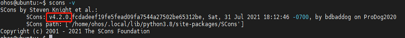

# 智能垃圾桶

## 一、 介绍

智能垃圾桶可以通过数字管家应用来监测垃圾桶当前可用容量，提醒主人及时处理垃圾；通过日程管家可以实现和其他智能设备联动。

| 核心组件   | 位置                 | 功能                             |
| ---------- | -------------------- | -------------------------------- |
| 距离传感器 | 置于垃圾桶盖内侧     | 感应垃圾量                       |
| 红外传感器 | 置于垃圾桶前端       | 感应是否有人靠近                 |
| 光敏电阻   | 开发板上固定         | 感应照明情况                     |
| LED灯      | 开发板上固定         | 模拟晚上照明灯，和红外传感器联动 |
| 舵机       | 垃圾桶盖下方合适位置 | 通过转动，控制垃圾桶盖的开关     |


#### 1. 交互流程

&nbsp;

如上图所示，智能垃圾桶整体方案原理图可以大致分成：智能垃圾桶设备、数字管家应用、云平台三部分。智能垃圾桶通过MQTT协议连接华为IOT物联网平台，从而实现命令的接收和属性上报。 关于智能设备接入华为云IoT平台的详细细节可以参考 [连接IOT云平台指南](../iot_huawei/README.md)；智能设备同数字管家应用之间的设备模型定义可以参考[profile](https://gitee.com/openharmony-sig/knowledge_demo_smart_home/tree/master/profile/智能垃圾桶profile定义.md) .


#### 2.实物简介

&nbsp;

我们使用 Pegasus物联网开发套件来模拟智能垃圾桶设备；

reset按键控制设备重启；reset按键组合控制按键可以清除已保存的配网信息，具体操作：先按下控制按键user，然后按下reset按键,1-2秒后再松开reset按键；

通过NFC模块实现设备碰一碰快速配网。


#### 3.实物操作体验

&nbsp;


## 二、快速上手

#### 1. 硬件准备

 Pegasus物联网开发套件一套([购买链接](https://item.taobao.com/item.htm?spm=a1z10.1-c-s.w5003-23341791452.6.49594a82I1k4xb&id=638314924130&scene=taobao_shop))

 预装HarmonyOS手机一台


#### 2、Linux编译服务器基础环境准备

开发基础环境由windows 工作台和Linux  编译服务器组成。windows 工作台可以通过samba 服务或ssh 方式访问Linux编译服务器。其中windows 工作台用来烧

录和代码编辑，Linux编译服务器用来编译OpenHarmony代码，为了简化步骤，Linux编译服务器推荐安装Ubuntu20.04。


##### 安装和配置Python

1. 打开Linux终端。

2. 输入如下命令，查看python版本号，需要使用python3.7以上版本,否则参考 [系统基础环境搭建](https://gitee.com/openharmony/docs/blob/OpenHarmony_1.0.1_release/zh-cn/device-dev/quick-start/%E6%90%AD%E5%BB%BA%E7%B3%BB%E7%BB%9F%E5%9F%BA%E7%A1%80%E7%8E%AF%E5%A2%83.md)。

   ```
   python3 --version
   ```

3. 安装并升级Python包管理工具（pip3）。

```
sudo apt-get install python3-setuptools python3-pip -y
sudo pip3 install --upgrade pip
```


##### 安装hb

1. 运行如下命令安装hb

   ```
   python3 -m pip install --user ohos-build
   ```

2. 设置环境变量

   ```
   vim ~/.bashrc
   ```

   将以下命令拷贝到.bashrc文件的最后一行，保存并退出。

   ```
   export PATH=~/.local/bin:$PATH
   ```

   执行如下命令更新环境变量。

   ```
   source ~/.bashrc
   ```

3. 执行"hb -h"，有打印以下信息即表示安装成功.

   ```
   usage: hb
   
   OHOS build system
   
   positional arguments:
     {build,set,env,clean}
       build               Build source code
       set                 OHOS build settings
       env                 Show OHOS build env
       clean               Clean output
   
   optional arguments:
     -h, --help            show this help message and exit
   ```


#### 3、Hi3861开发环境准备

在Linux编译服务器上搭建好基础开发环境后，需要安装OpenHarmony 编译Hi3861 平台特有的开发环境。


##### 安装编译依赖基础软件

```
sudo apt-get install -y build-essential gcc g++ make zlib* libffi-dev
```


##### 安装Scons

1. 打开Linux 终端。

2. 运行如下命令，安装Scons安装包。

   ```
   python3 -m pip install scons
   ```

3. 运行如下命令，查看是否安装成功。如果安装成功，查询结果下图所示。

   ```
   scons -v
   ```

   下图 Scons安装成功界面，版本要求3.0.4以上

   &nbsp;


##### 安装python模块

```
sudo pip3 install setuptools kconfiglib pycryptodome ecdsa six --upgrade --ignore-installed six
```


#####  安装gcc_riscv32（WLAN模组类编译工具链）

1. 打开Linux终端。

2. 下载gcc_riscv32镜像，[下载链接](https://repo.huaweicloud.com/harmonyos/compiler/gcc_riscv32/7.3.0/linux/gcc_riscv32-linux-7.3.0.tar.gz)。

3. 设置环境变量

   将压缩包解压到根目录

   ```
   tar -xvf gcc_riscv32-linux-7.3.0.tar.gz -C ~
   ```

   设置环境变量。

   ```
   vim ~/.bashrc
   ```

   将以下命令拷贝到.bashrc文件的最后一行，保存并退出。

   ```
   export PATH=~/gcc_riscv32/bin:$PATH
   ```

   生效环境变量。	

   ```
   source ~/.bashrc
   ```

4. 在命令行中输入如下命令，如果能正确显示编译器版本号，表明编译器安装成功。

   ```
   riscv32-unknown-elf-gcc -v
   ```


#### 4、源码下载&编译准备

##### 1.码云工具下载

```
cd ~
curl https://gitee.com/oschina/repo/raw/fork_flow/repo-py3 > /usr/local/bin/repo
chmod a+x /usr/local/bin/repo
pip3 install -i https://pypi.tuna.tsinghua.edu.cn/simple requests
```


##### 2.代码下载

###### 1) OpenHarmony代码下载

```
#特别注意：请下载OpenHarmony 1.0.1 版本，后续会更新支持OpenHarmony其他版本
cd ~
repo init -u git@gitee.com:openharmony/manifest.git -b OpenHarmony_1.0.1_release --no-repo-verify
repo sync -c
repo forall -c 'git lfs pull'
```


###### 2) 设备侧代码下载

具体仓库地址：https://gitee.com/openharmony-sig/knowledge_demo_smart_home/

下载方式1：直接下载仓库对应zip 包文件

下载方式2：fork knowledge_demo_smart_home仓库后，使用git 命令下载

```
cd ~
git clone git@gitee.com:xxxxxxx/knowledge_demo_smart_home.git  // 其中xxxxxxx为fork后相关账号名字。
```


###### 3) 编译前准备

1. 代码拷贝

   ```
   cp -rfa  ~/knowledge_demo_smart_home/dev/team_x  ~/OpenHarmony1.01/vendor/
   cp -rfa  ~/knowledge_demo_smart_home/dev/third_party/iot_link  ~/OpenHarmony1.01/third_party/
   ```

2) Hispark 开发板特定修改

   1) 修改usr_config.mk 文件

      地址：device/hisilicon/hispark_pegasus/sdk_liteos/build/config/usr_config.mk

      ```
      使能如下配置项
      CONFIG_I2C_SUPPORT=y
      CONFIG_PWM_SUPPORT=y
      ```

   2)  修改wifiservice 文件夹

      地址：device/hisilicon/hispark_pegasus/hi3861_adapter/hals/communication/wifi_lite/wifiservice/source/wifi_hotspot.c

      ```
      EnableHotspot函数中屏蔽如下字段
      139     //if (SetHotspotIpConfig() != WIFI_SUCCESS) {
      140     //    return ERROR_WIFI_UNKNOWN;
      141     //}
      ```

      地址：device/hisilicon/hispark_pegasus/hi3861_adapter/hals/communication/wifi_lite/wifiservice/source/wifi_device.c

      ```
      DispatchConnectEvent函数下 屏蔽StaSetWifiNetConfig相关代码行
      239         //StaSetWifiNetConfig(HI_WIFI_EVT_CONNECTED);
      260        //StaSetWifiNetConfig(HI_WIFI_EVT_DISCONNECTED);
      ```

整合并修改完成后的目录结构如下图：

&nbsp;


#### 5、编译&烧录

```
编译命令：
hb set  // 如果是第一次编译，Input code path 命令行中键入"./" 指定OpenHarmony工程编译根目录后 回车，
如下图所示，使用键盘上下键选中智能台灯
```

&nbsp;


```
hb build // 如果需要全量编译，可以添加-f 选项
```

详细的代码编译及固件烧录步骤，请参考 [编译和烧录指南](../build_and_burn/README.md)


#### 6、设备配网

1) 在设备上电前需准备好安装了数字管家应用的HarmonyOS手机，详情见[数字管家应用开发](https://gitee.com/openharmony-sig/knowledge_demo_smart_home/blob/master/FA/DistSchedule/README_zh.md), 并在设置中开启手机的NFC功能；
2) 写设备NFC标签，详细操作见设备[NFC标签指导文档](https://gitee.com/openharmony-sig/knowledge_demo_smart_home/blob/master/dev/docs/NFC_label_definition/README.md);
3) 烧录完成后，上电。开发者在观察开发板上状态LED灯以８Hz的频率闪烁时，将手机上半部靠近开发板NFC标签处；
4) 无需任何操作手机将自动拉起数字管家应用并进入配网状态，配网过程中无需输入热点账号密码。 具体无感配网相关流程参考 [无感配网指南](../net_config/README.md)

&nbsp;

