## 一、 介绍

本项目是基于BearPi套件开发的智能儿童手表系统，该系统通过与GSM模块（型号：SIM808）的通信来实现通话和定位功能。
    智能儿童手表系统可以通过云和手机建立连接，同步时间和获取天气信息，通过手机下达日程安排到儿童手表，并显示在儿童手表的屏幕端，还可以通过SIM808模块获取地理位置信息，接收和拨打电话等功能。

### 1. 产品示意图

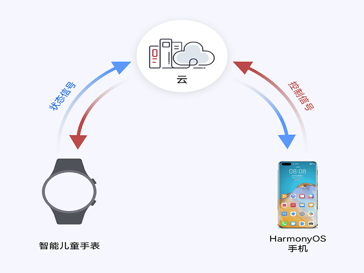

## 二、 快速上手

### 1.开发环境准备：

#### 1. 硬件准备

| bear派开发板套件  | x1   | [购买链接地址](https://item.taobao.com/item.htm?id=633296694816) |
| ----------------- | ---- | ------------------------------------------------------------ |
| SIM808通信板      | x1   | [购买链接地址](https://item.taobao.com/item.htm?spm=a1z1r.7974869.0.0.269c3ad42JKVHv&id=630026473221) |
| 预装HarmonyOS手机 | x1   |                                                              |

#### 2. 开发环境搭建

安装系统环境，请参考[获取源码及Ubuntu编译环境准备](https://gitee.com/openharmony/docs/blob/master/zh-cn/device-dev/quick-start/quickstart-lite-env-setup-linux.md#section1897711811517)

安装Hi3861开发环境，请参考[ Hi3861搭建环境](https://gitee.com/openharmony/docs/blob/OpenHarmony_1.0.1_release/zh-cn/device-dev/quick-start/Hi3861%E6%90%AD%E5%BB%BA%E7%8E%AF%E5%A2%83.md)

源码下载&编译准备，请参考[ 代码下载和编译准备](../prebuild/README.md)

编译和烧录，请参考[ 编译烧录](../build_and_burn/README.md)
#### 3.代码改动

由于3861的task数量有限，需要屏蔽掉一些任务：

在文件夹device/bearpi/bearpi_hm_nano/sdk_liteos/build/config/usr_config.mk内屏蔽掉AT相关的任务。
#CONFIG_AT_SUPPORT=y

在文件vendor/team_x/common/iot_boardled/iot_boardled.c屏蔽掉灯的任务。

// g_ledFlashController.taskID =  osThreadNew((osThreadFunc_t)LedTaskEntry, NULL, (const osThreadAttr_t *)&attr);

### 2. 代码目录结构

代码目录：

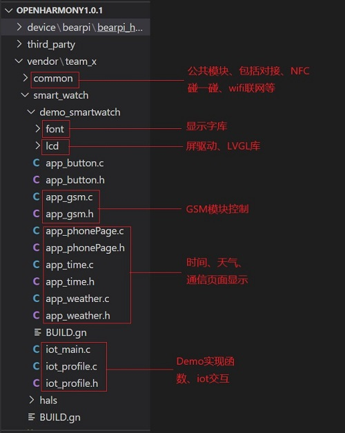

### 3.操作前的一些准备工作

#### 1.硬件调整

把E53板上的接口2与主板断开，此管脚复用为跑步计数器的中断引脚，会影响F2按键功能。把E53板上的拨档开关置为OFF，打开串口的TX(IO06)功能。具体见下图：

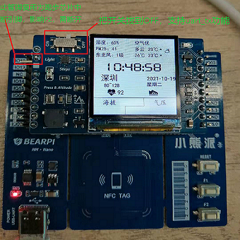

#### 2.串口线连接

小熊派板卡与SIM808串口线连接方法如下：

| 串口 | 小熊派端      | SIM808通信模块 |
| ---- | ------------- | :------------- |
| GND  | GND           | GND(J6接口)    |
| TX   | UART_TX(IO06) | RXD(J6接口)    |
| RX   | UART_RX(IO05) | TXD(J6接口)    |

具体实物图如下：

  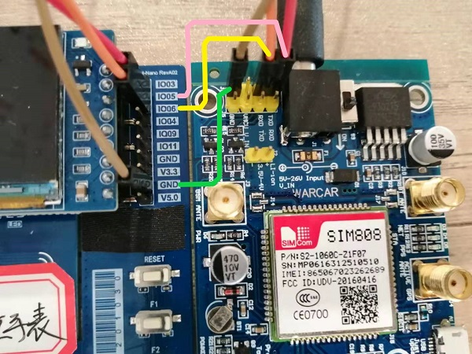

#### 3.电源和天线连接

  安装电源线和天线，最后的总的线材连接如下图：

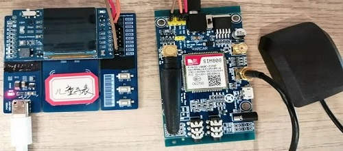

### 4.操作说明

#### 1.开发板上电

在小熊派开发板和SIM808模块都连接上电源后，先按小熊派复位按钮，启动小熊派开发板。然后再按SIM808模块的电源波动开关,然后按SIM808模块的POWER按键3秒以上。具体如下：

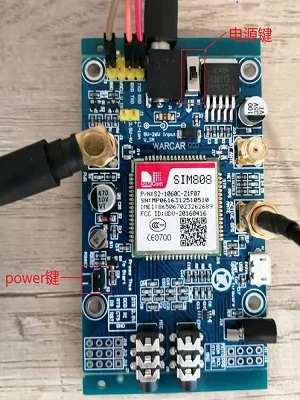

#### 2. 碰一碰配网

​    第一次使用小熊派板卡需要写NFC标签，具体操作见相关操作文档[设备连接NFC配置指南](../NFC_label_definition/README.md)。

​	按复位键重启手表设备，在上电的过程中按下F2键，进入碰一碰配网模式，使用带有鸿蒙系统的手机接触NFC感应区。然后手机跟设备互动，无感配置网络。碰图如下：

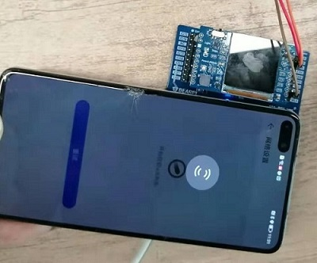

配网成功后，设备端LCD进入主页面显示，儿童手表会连接IOT云端服务器，注册成功后手机端显示如下：

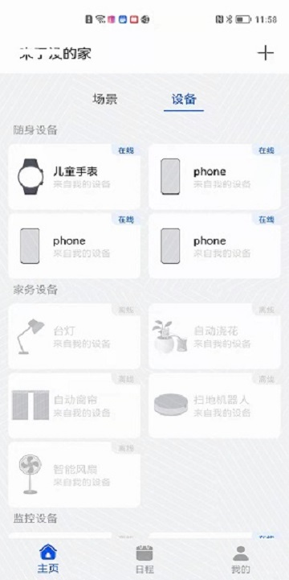

设备端LCD会点亮屏幕并进入显示主页面。

#### 3.主界面显示时间和天气信息

开机后会获取时间和天气信息，显示内容具体如下：

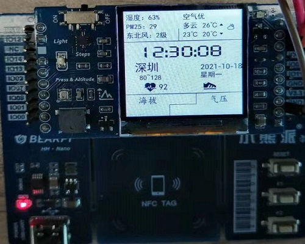

#### 4.设置联系人和拨打电话

手机端设置紧急联系人电话号码：在手机端的儿童手表详情页，点击紧急联系人菜单的【+】,具体如下图：

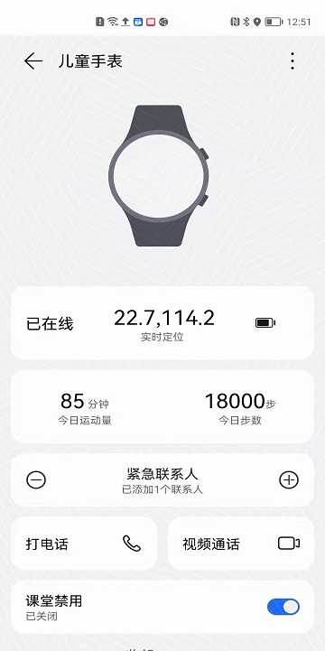

设置需要拨打的电话号码，暂时支持设置两个电话号码：

​	第一个电话号码：father:18688888888

​	第二个电话号码：mother:18689999999

具体操作如下：

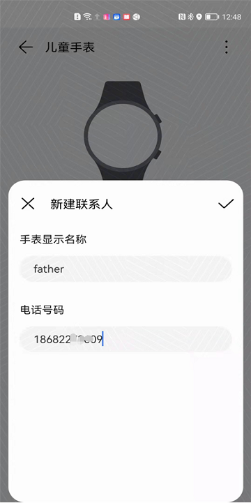

删除联系人的操作跟上面的步骤类似，在紧急联系人选项列表中选择【-】操作，不做过多赘述。

手机端设置完电话号码后，然后短按手表端的F2按键，进入拨打号码界面，具体如下：

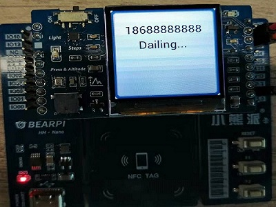

长按儿童手表的F2按键3秒以上，进入电话簿界面，然后再短按F2按键可选择联系人，最后长按F2按键保存并退出，下次再次短按F2按键就拨打上次选择的号码。具体如下图：

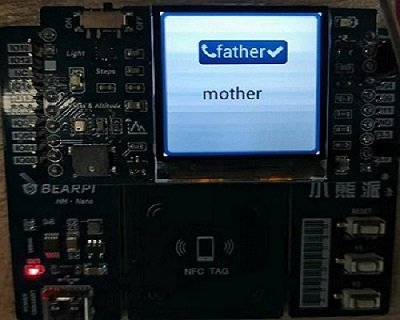

#### 5.接电话

若有电话打入，设备端会进入来电显示界面，可以短按F2接听，然后再次短按F2可挂断电话。来电界面如下：

###                      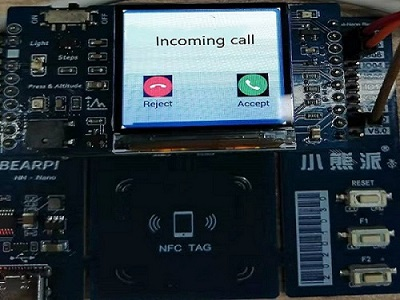

#### 6.GPS地理位置上报

GPS位置上报。若设备端与SIM808模块通过串口已连接，上电后会设备会控制SIM808通过命令打开GPS的POWER，然后查询GPS信息，由于此模块属于2G信号，反应比较慢，需要等待2分钟左右，模块需要放置在室外比较空旷的位置才能获取到位置信息。获取到的地理位置显示在手机端的儿童手表详情页界面，具体如下：

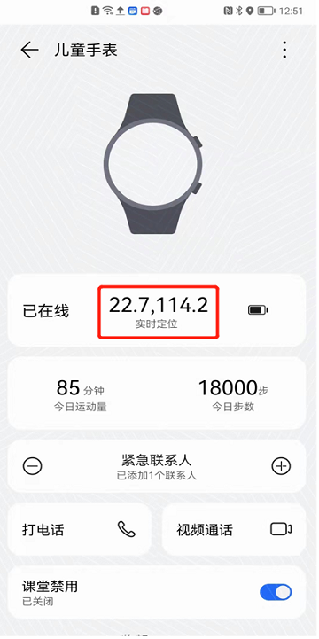

#### 7.日程安排设置：

在手机端的“日程”界面，选择右上角的“+”按钮。弹出“新增日程”菜单项，如下图：

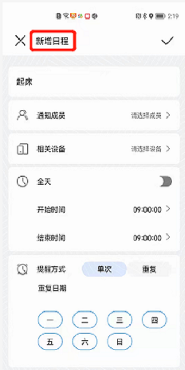

写入日程名称，例如“起床”，现可选择【起床，吃饭，睡觉，吃药，喝水，写作业】，如下图：

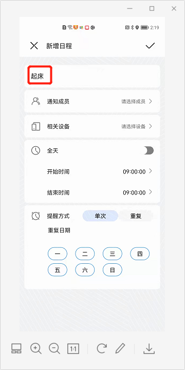

【通知成员】选项选择需要通知的设备，如下图：

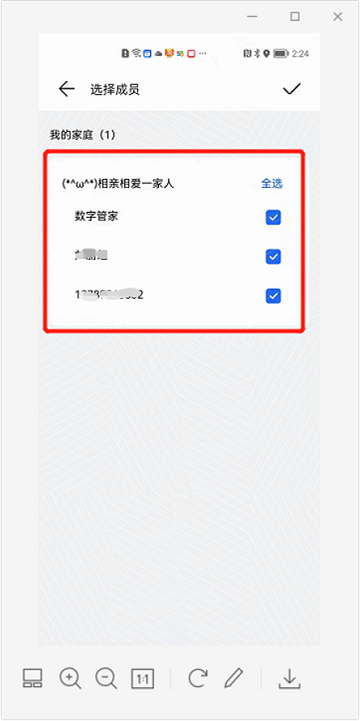

【相关设备】选项选择需要操作的设备，如下图：

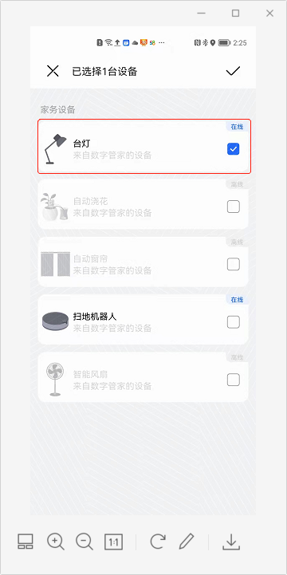

开始时间和结束时间选择需要通知的时间，如下图：

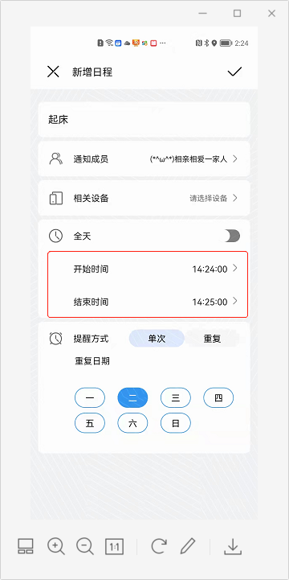

提醒方式可选择需要周几提醒，如下图：

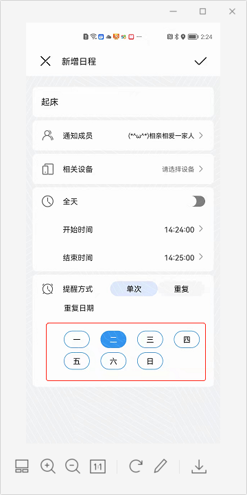

最后选择【√】下发日程到设备端。然后等待时间到，设备端提示相关信息。

