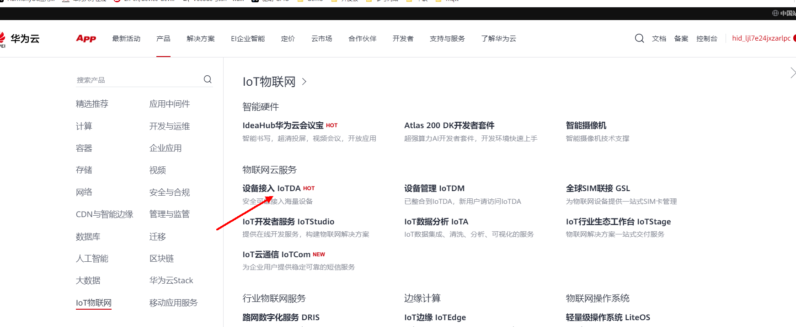
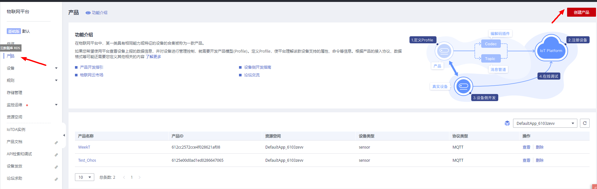
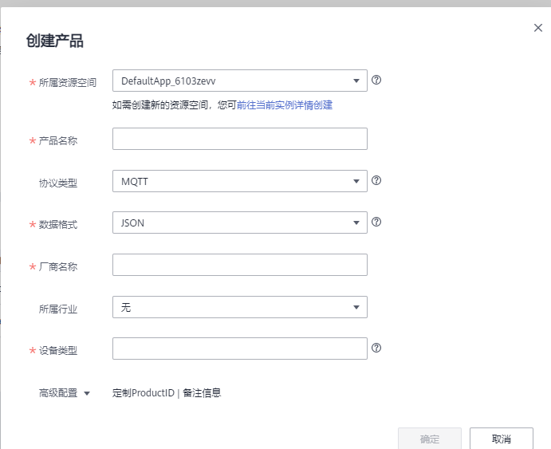
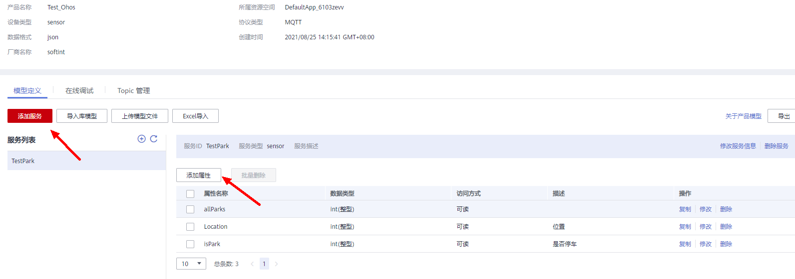
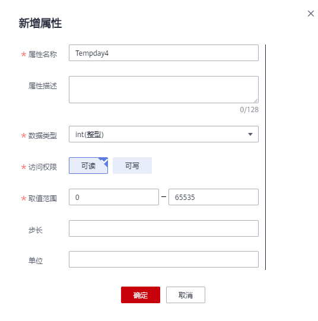
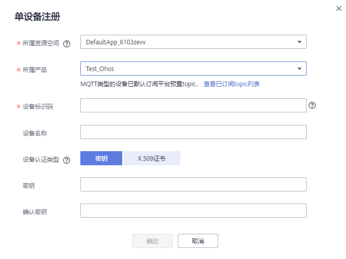
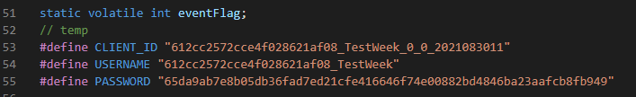
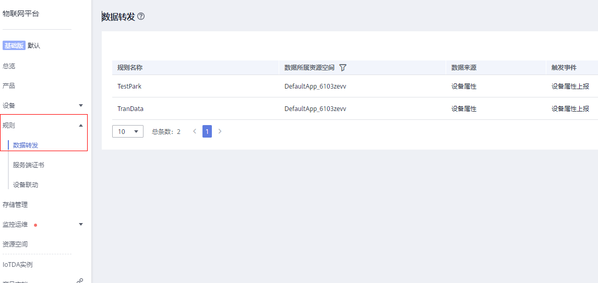
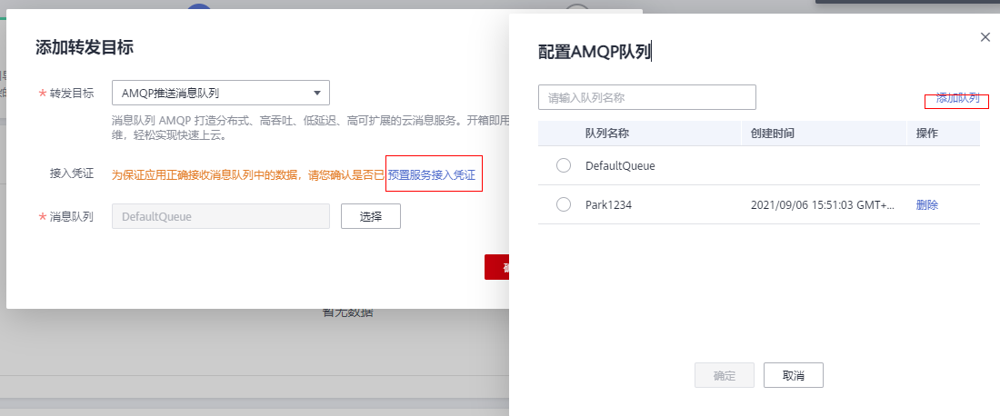

# 智能停车设备端代码介绍

## 简介：
  	本Demo是基于LYEVK-3861A IoT 开发套件开发，通过获取光照强度变化感知是否有车停放。
  	特别说明：设备端代码基于开源版本code_3.0 LTS版本

## 产品配置


### 登录

设备接入华为云平台之前，需要在平台注册用户账号，华为云地址：<https://www.huaweicloud.com/>

在华为云首页单击产品，找到IoT物联网，单击设备接入IoTDA 并单击立即使用。




### 创建产品

在设备接入页面可看到总览界面，展示了华为云平台接入的协议与域名信息，根据需要选取MQTT通讯必要的信息备用。

接入协议（端口号）：MQTT 1883

选中侧边栏产品页，单击右上角“创建产品”



在页面中选中所属资源空间，并且按要求填写产品名称，选中MQTT协议，数据格式为JSON，并填写厂商名称，选择所属行业以及添加设备类型，并单击右下角“确定”如图：



创建完成后，选择“查看详情”，在产品页会自动生成刚刚创建的产品，单击“查看”可查看创建的具体信息。

单击产品详情页的自定义模型，在弹出页面中新增服务，自定义服务ID：



在服务ID的下拉菜单下点击“添加属性”填写相关信息：




### 注册设备

在侧边栏中单击“设备”，进入设备页面，单击右上角“注册设备”，勾选对应所属资源空间并选中刚刚创建的产品，注意设备认证类型选择“秘钥”，按要求填写秘钥。



记录下设备ID和设备密钥

注册完成后，在设备页面单击“所有设备”，即可看到新建的设备，同时设备处于未激活状态。


### 设备绑定
在连接平台前需要获取CLIENT_ID、USERNAME、PASSWORD，访问[这里](https://iot-tool.obs-website.cn-north-4.myhuaweicloud.com/)，填写注册设备时生成的设备ID和设备密钥生成连接信息（ClientId、Username、Password），并将修改代码对应位置。


### 消息转发
新建规则->数据转发，用于转发设备属性上报的消息到应用侧。


设置转发目标时，选择AMOP推送消息队列，同时要预置消息凭证，并设置具体的转发队列，应用侧根据队列接受转发消息。具体设置方法，参考官方说明。



关于应用侧如果接受消息，请参考官方说明。

## 代码编译

 1） 拉取相关代码后，拷贝代码demo_park目录到OpenHarmony的源码中。目录为applications/sample/wifi-iot/app

可见demo_park目录结构如下：

```
demo_park    
├── BUILD.gn
├── include
│   ├── iot_adc.h
│   ├── iot_wifi.h
│   ├── oc_iot_cloud.h
│   ├── oc_mqtt.h
│   └── oc_mqtt_profile_package.h
└── src
    ├── demo_park.c   #具体实现
    ├── iot_adc.c
    ├── iot_wifi.c
    ├── oc_mqtt.c
    ├── oc_mqtt_profile_package.c
    └── wifi_connect.c
```

3） 修改app/BUILD.gn 文件

    配置./applications/sample/wifi-iot/app/BUILD.gn文件，在features字段中增加索引，使目标模块参与编译。features字段指定业务模块的路径和目标，features字段配置如下。
```  
    import("//build/lite/config/component/lite_component.gni")
    
    lite_component("app") {
    features = [
        "demo_park",
    ]
    deps = []
}

```
4） 打开三方驱动中的编译宏
		打开：device/hisilicon/hispark_pegasus/sdk_liteos/build/config/usr_config.mk
         找到：CONFIG_I2C_SUPPORT is not set，修改为CONFIG_I2C_SUPPORT=y

5）代码修改

​      修改以下的代码参数为当前的wifi和密码。

```
BOARD_ConnectWifi("Test", "11111111");
```


6) 引入三方paho_mqtt库

 下载三方开源[paho_mqtt](https://gitee.com/flowerzhang/third_party_paho_mqtt)库，改名为paho_mqtt放置在Openharmony源码的third_party目录下。
 备注：此库已经做过移植适配，可直接使用。

7） 编译后烧录bin 文件
	    编译环境、源码获取等参考：https://gitee.com/openharmony/docs/blob/master/zh-cn/device-dev/quick-start/Readme-CN.md
   	 编译命令：1、hb set // 设置工程目录和选择相应目标 
   	 					   wifiiot_hispark_pegasus

​                   2、hb build -f 
   	 烧录步骤：请参考 “Hi3861开发板第一个示例程序.md” 镜像烧录 烧录章节。


​	